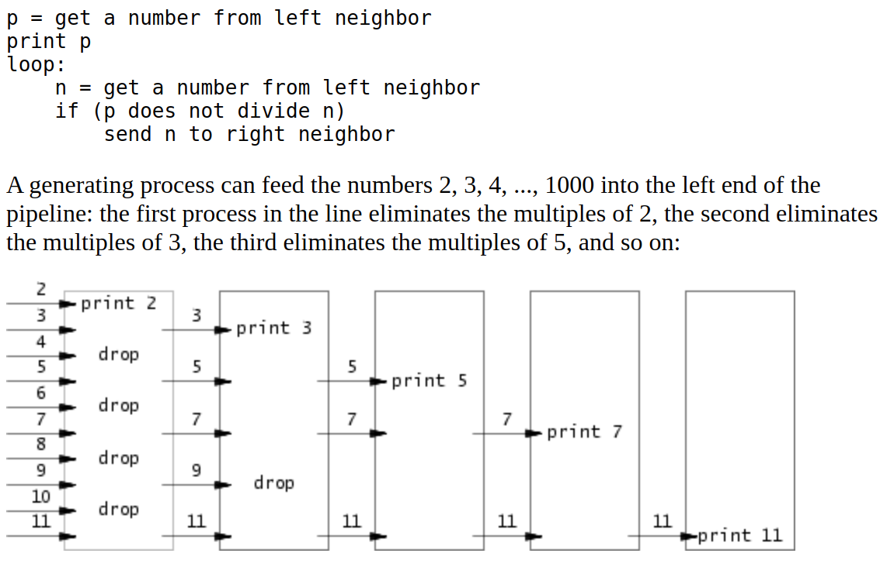

make grade 来测试
## sleep (easy)
实现unix 程序sleep

提示：
- 阅读xv6 book
- 看一些示例程序，在user/中
- 如果user忘记传参，打印一个错误消息
- 可以使用atoi(user/ulib.c)
- 使用sleep系统调用
- 观看kernel/sysproc.c 源代码，sleep系统调用的具体实现(sys_sleep)
  user/user.h方便用户程序调用
  user/usys.s方便汇编语言从用户代码跳转到sleep
- 确保main调用exit()
- 把sleep 程序加到UPROGS in makefile
  
        #include "kernel/types.h"
        #include "kernel/stat.h"
        #include "user/user.h"

            int main(int argc , char *argv[]){
                if(argc != 2){
                    fprintf(2,"usage : %s <seconds> \n",argv[0]);
                    exit(1);
                }
                int seconds = atoi(argv[1]);
                sleep(seconds);
                exit(0);
            }

kernel中的.h一定要被加在前面

## pingpong(easy)
    #include "kernel/types.h"
    #include "kernel/stat.h"
    #include "user/user.h"

    int main(){
        int fd[2]; // read write
        pipe(fd);
        char buf[1] = "1";
        if(fork() == 0){
            close(fd[0]);
            write(fd[1],buf,1);
            printf("%d: received ping\n",getpid());
            exit(0);
        }else{
            close(fd[1]);
            read(fd[0],buf,1);
            wait(0);
            printf("%d: received pong\n",getpid());
        }
        exit(0);
    }

## primes (moderate)/(hard)

#include "kernel/types.h"
#include "kernel/stat.h"
#include "user/user.h"

void handler(int readfd)
{
    int newfd[2];
    int p, n;
    if (read(readfd, &p, sizeof(int)))
    {
        printf("prime %d\n", p);
        if (read(readfd, &n, sizeof(int)))
        {
            pipe(newfd);
            if (fork() == 0)
            {
                close(newfd[1]);
                handler(newfd[0]);
            }
            else
            {
                close(newfd[0]);
                if (n % p != 0)
                    write(newfd[1], &n, sizeof(int));
                while (read(readfd, &n, sizeof(int)))
                {
                    if (n % p != 0)
                        write(newfd[1], &n, sizeof(int));
                }
                close(newfd[1]);
                close(readfd);
                wait(0)
            }
        }
    }

    exit(0);
}
int main()
{
    int fd[2]; // read and write
    pipe(fd);
    int i;
    if (fork() == 0)
    {
        close(fd[1]);
        handler(fd[0]);
    }
    else
    {
        close(fd[0]);
        for (i = 2; i <= 35; i++)
        {
            write(fd[1], &i, sizeof(int));
        }
        close(fd[1]);
    }
    wait(0);
    exit(0);
}
用迭代的方法为每个素数创建一个进程素数filter
