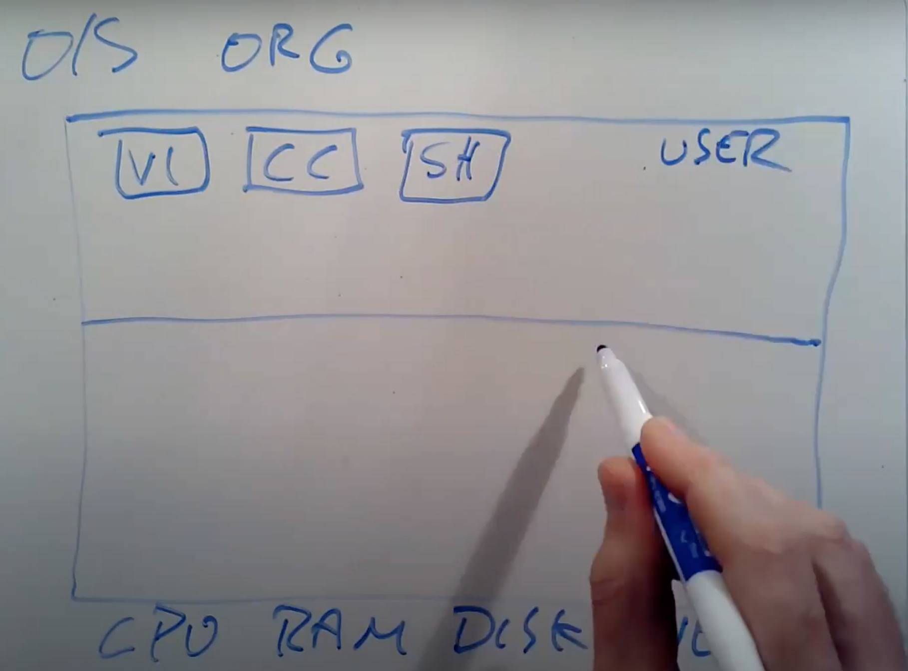
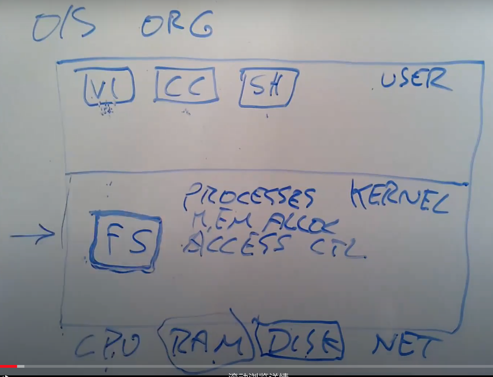
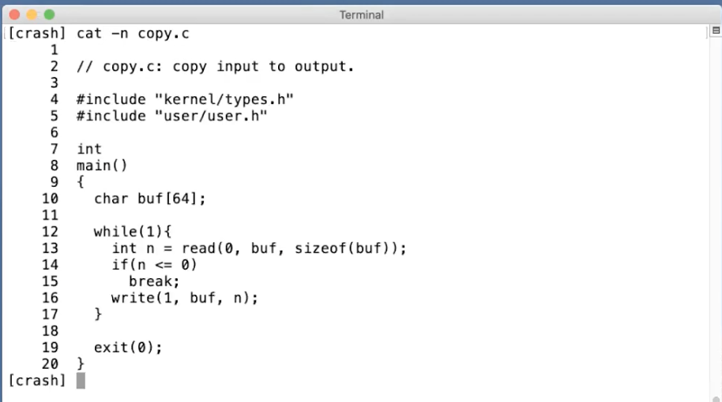

- [Introduction and Examples](#introduction-and-examples)
  - [Book Reading(Chapter 1 OS interfaces)](#book-readingchapter-1-os-interfaces)
    - [1.1 Processes and memory](#11-processes-and-memory)
    - [1.2 I/O and File descriptors](#12-io-and-file-descriptors)
    - [1.3 Pipe](#13-pipe)
    - [1.4 File system](#14-file-system)
  - [Class](#class)
    - [1.1 课程内容简介](#11-课程内容简介)
    - [1.2 操作系统结构](#12-操作系统结构)
    - [1.3 Why hard and interesting](#13-why-hard-and-interesting)
    - [1.5 read , write , exit系统调用](#15-read--write--exit系统调用)
    - [1.6 open系统调用](#16-open系统调用)
    - [1.7 Shell](#17-shell)
    - [1.8 fork系统调用](#18-fork系统调用)
    - [1.9 exec , wait系统调用](#19-exec--wait系统调用)
    - [1.10 I/O 重定向](#110-io-重定向)
# Introduction and Examples
## Book Reading(Chapter 1 OS interfaces)
### 1.1 Processes and memory
| System call                         | Description                                                         |
| ----------------------------------- | ------------------------------------------------------------------- |
| int fork()                          | Create aprocess , return child‘ PID                                 |
| int exit(int status)                | 关闭当前进程，status报告给wait()                                    |
| int wait(int *status)               | Wait for a child to exit ; exit status in *status;returns child PID |
| int kill(int pid)                   | Terminate process PID.Returns 0 or -1 for error                     |
| int getpid()                        | return the current pid                                              |
| int sleep(int n)                    | pause for n clock ticks                                             |
| int exec(char *file,char *argv[])   | load a file and execute it with arguments;                          |
| char *sbrk(int n)                   | Grow process’s memory by n bytes. Returns start of new memory.      |
| int open(char *file, int flags)     | 打开一个文件，flags代表只读/只写.返回一个fd                         |
| int write(int fd, char *buf, int n) | Write n bytes from buf to file descriptor fd; returns n             |
| int read(int fd, char *buf, int n)  | Read n bytes into buf;returns number read; or 0 if end of file.     |
| int close(int fd)                   | Release open file fd                                                |
| int dup(int fd)                     | 返回一个新的文件描述符指向fd                                        |
| int pipe(int p[])                   | 创建一个管道，把读/写的文件描述符分别放到p[0],p[1]                  |
| int chdir(char *dir)                | 改变当前文件夹                                                      |
| int mknod(char *file,int,int)       | 创建一个设备文件                                                    |
| int fstat(int fd ,struct stat *st)  | 把文件描述符打开的文件相关信息放到st中                              |
| int stat(char *file,struct stat*st) | 把文件相关信息放到st中                                              |
| int link(char *file1,char*file2)    | 给file1创造一个新的名字                                             |
| int unlink(char *file)              | 删除一个文件                                 於其後在史丹佛大
### 1.2 I/O and File descriptors
文件描述符是一个比较小的int值，它由内核管理。
它可能来自于文件、文件夹、设备、管道、复制一个已有的fd,但是文件描述符把这些抽象为字节流，称为I/O
0(标准输入)，1(标准输出)，2(标准错误)

char buf[512];於其後在史丹佛大
while(1){
    n = read(0 ,buf,sizeof(buf));
    if(n < 0 ){
        fprintf(stderr,"read error\n" );
        exit(1);
    }
    if(n == 0 ){
        break;
    }
    if(write(1,buf,n) != n){
        fprintf(2,"write error\n");
        exit(1);
    }
}
- 当fork()产生一个子进程后，文件描述符也会随之复制一份相同的。他们共享相同的设备，但是在子进程中关闭一个fd，不会影响父进程中相同的fd
- open()总会选择最小的空闲文件描述符，如果关闭了0，那么open返回的就是0

        char *argv[2]
        argv[0] = "cat"
        argv[1] = 1;
        if(fork() == 0){
            Close(0);
            open("input.txt",O_RDONLY);
            exec("cat",argv);
        }

open第二个参数控制open的行为:O_RDONLY , O_WRONLY ,O_RDWR , O_CREATE , O_TRUNC
O_CREATE会创建一个文件如果它不存在，O_TRUNC会把一个文件截断到0
所以fork一个子进程来运行exec是很有帮助的，可以做到不影响shell情况下重定位IO
**父子相同文件描述符中file offset时刻共享**
但是如果是一个文件打开两次，返回的两个fd中不共享offset。必须使用dup(int fd)来复制文件描述符

### 1.3 Pipe
管道为进程提供了一个交互的方式
int p[2];
char *argv[2];
argv[0] = "wc";
argv[1] = 0;
pipe(p); // read + write fd

    if(fork() == 0){
        close(0);
        dup(p[0]);
        close(p[0]);
        close(p[1]);
        exec("/bin/wc",argv);
    }else{
        close(p[0]);
        write(p[1],"hello world\n,12);
        close(p[1]);
    }
**write fd|read fd**
子进程中，我们关闭了fd = 0 , 然后把p[0]复制，新的描述符为0作为stdin.
child close the write side;
parent close the read side;
读端会等待数据被写进或者读端所有fd被关闭.所以子进程读端必须要关闭它的写端，否则可能会永远blocked.
xv 6中:
read | write相当于一个二叉树，| 为 interior node p , p->left = read,p->right = write
左右两边都是一个独立子进程，而管道会等待两个子进程都完成才返回。

### 1.4 File system
xv6 file system 提供数据文件，文件夹(包含name references to data files and other directories);
directories form a tree,从一个根目录'/'开始 ,
绝对路径:"/a/b/c"
如果不以/开头，那么为相对路径，从当前目录开始.
e.x.

    chdir("/a");
    chdir("/b");
    open("c",O_RDONLY);

    等价于
    open("/a/b/c",O_RDONLY);

mkdir:创建文件夹 
> mkdir("/dir);

open with O_CREATE 会创建一个普通文件
> fd = open("/dir/file",O_RDONLY| O_CREATE);
close(fd)

mknod 可以创建一个设备文件
> mknod("/console",1,1);

major,minor numbers uniquely identify a kernel device;
设备文件为周边文件提供简单的接口，比如打印机。如果打开了一个设备文件，它会把read 和write转向到内核中设备的实现。

文件的名字和文件本身是不同的.一个文件称为*inode*,可以有许多名字,称为*links*
每个link包括一个键值对,file name 和 reference to an inode.
一个inode包含一个文件的metadata元数据，包括中type,length , 在磁盘上的位置，the number of links to a file

fstat系统调用可以从一个inode上取元数据,在stat结构里填满.

    #define T_DIR  1
    #define T_FILE 2
    #define T_DEVICE 3
    struct stat{
        int dev;
        uint ino ;inode number
        short type;
        short nlink;number of links to file
        uint64 size; 
    }

link()可以创建一个新的link
open("a",OCREATE | O_WRONLY);
link("a","b");
//这里向a读写和b读写相同

unlink()可以在file system里移除一个名字,文件的inode和disk space只有在link count = 0 且没有file discriptor 指向它的时候被free

    fd = open("/tmp/xyz",O_CREATE|O_RDWR);
    unlink("/tmp/xyz);
是一个惯用手段来创建一个没有名字的文件，它会在fd被关闭之后清除

## Class
### 1.1 课程内容简介
课程的目标：
- 理解操作系统的设计和实现。设计是指整体的结构，实现是指具体的代码
- 可以通过一个小的XV6操作系统，获得实际动手经验

操作系统统一的目标
- (Abstraction)抽象硬件，计算机里面包含了CPU，内存等等，这是非常低级的资源。但是我们通过操作系统，把这些低级资源整合抽象为接口，例如：进程，文件系统。
- (Multiplex),在多个应用程序之间共用硬件资源。我们看到操作系统和硬件配合起来可以十分神奇的达到互不干扰，同时运行
- (Isolation),如果一个程序发生故障，多个程序之间应该互不干扰
- (Sharing),有时候我们需要数据共享，协同完成任务。
- (Security),我们在共享的同时，有时候也希望一些资源不被共享，其他程序访问不到。
- (Performance),操作系统不应该组织应用系统获得高性能的可能性
- 操作系统需要支持大量不同类型的应用程序。
  
### 1.2 操作系统结构

矩形表示一个计算机，它有硬件资源包括CPU，内存，磁盘和网卡等。在最低一层
在最上层，我们会运行各种应用程序，VI，CC，SH等，这个空间称为用户空间
而有一个特殊的程序总是在运行，它称为Kernel（内核）
它维护数据，管理每一个进程，同时维护大量数据结构帮助管理硬件资源。同时Kernel还会有大量的内置服务，Kernel会有文件系统实现文件名，文件内容，目录等，并理解如何将文件存储在硬盘中。所以用户空间的程序是先和kernel中的文件系统交互，文件系统和磁盘交互.
我们的主要关注点在kernel,kernel内软件的架构，连接kernel和用户程序的接口。我们会关心kernel中的服务，一个是文件管理系统，另一个是进程管理系统。
目前，文件系统的作用是管理文件内容并且找出文件具体在磁盘的哪个位置。文件系统还维护了一个独立的命名空间，每个文件都有文件名，同时它还有一个曾集目录，每个目录包含一些文件。
从Security层面考虑，kernel会有Acess control机制，决定进程使用某些资源是否有权限。

kernel和用户空间程序的交互往往是通过System call 实现的。

一些example ...

### 1.3 Why hard and interesting
1.学习操作系统比较困难的一个原因是，编程环境比较恶劣。因为我们在编写一个应用程序时候，底下是操作系统。而在编写Kernel时，底下是硬件系统，虽然课程使用qemu来模拟硬件环境，但是还是比较恶劣。
2.另外一个原因是，操作系统的需求往往比较矛盾，难以平衡：
- (efficient vs Abstract)高效 vs 易用。高效意味着操作系统要在接近硬件层面操作，而易用要求操作系统提供抽象接口。
- (Powerful vs Simple)提供简单又强大的接口十分困难
- (Flexible vs Security)希望给应用程序更多灵活性，但是在一定程序上又要限制应用程序。
  
3.操作系统提供了大量特性和服务，他们可能会趋向于相互交互。
例如open 与 fork 之间的交互

### 1.5 read , write , exit系统调用

这里我们使用了三个系统调用,read,write exit

read接收三个参数：
1. 文件描述符，shell会确保在默认情况下,0为stdin , 1为stdout , 2 为stderr
2. 指向某段内存的指针，c语言也可以直接"xxx";
3. 代码想要读取的最大长度
   
read的返回值可能是读到的字节数，输入xyzzy,那么就是6(加上\n符号)

### 1.6 open系统调用
文件描述符本质上对应了内核中的一个表单数据。内核维护了每个运行进程的状态，它会为每个进程保存一个表单，key为file descriptor.

### 1.7 Shell
### 1.8 fork系统调用
### 1.9 exec , wait系统调用
> char *argv[] = {"echo" , "this" ,"is","echo",0};

最后一个0要记得加
代码执行exec系统调用，相当于丢弃了调用进程的内存，开始执行新加载的指令。
- exec调用会保留当前的文件描述符表单
- exec一般不会返回,只有出错会返回
  
我们发现见fork 再 exec或许比较浪费，因为这样先拷贝了所有的内存，对于大程序来说这是一个比较严重的问题。
在后面会用到copy-on-write fork，只拷贝执行exec所需要的内存1
### 1.10 I/O 重定向