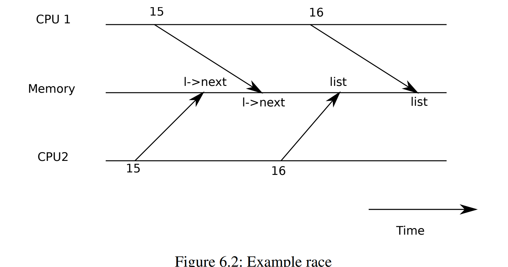

- [Lecture 10 : Multiprocessors and locking](#lecture-10--multiprocessors-and-locking)
  - [Book Reading : Chapter 6 Locking](#book-reading--chapter-6-locking)
    - [6.1 Race conditions](#61-race-conditions)
    - [6.2 Code : Locks](#62-code--locks)
    - [6.3 Code : Using locks](#63-code--using-locks)
    - [6.4 Deadlock & lock ordering](#64-deadlock--lock-ordering)
    - [6.5 Re-entrant locks](#65-re-entrant-locks)
    - [6.6 Locks and interrupt handlers](#66-locks-and-interrupt-handlers)
    - [6.7 : Instruction and memory ordering](#67--instruction-and-memory-ordering)
    - [6.8 Sleep locks](#68-sleep-locks)
# Lecture 10 : Multiprocessors and locking

## Book Reading : Chapter 6 Locking

许多内核，包括xv6都实现了许多活动的交叉执行，其中一个来源是多处理器的硬件结构。在RISC-V上，许多CPU核共享Physical RAM,xv,xv6运用这个共享性来创建一些所有CPU都能读写的数据结构，这样就有可能导致不同CPU在同一时间进行读写。

> Concurrency 代表不同的程序流交错执行，来源于多处理器、多线程和中断

内核中有许多并行访问的数据，例如kalloc中，如果两个进程同时调用函数，从freelist中pop出的是哪个页呢？并行性可以提高性能和反映度.是并行能够正确的实现称为*Concurrency Control*

Xv6使用了许多并行控制技术，这一章关注**锁**,它提供了CPU之间执行的互斥，确保只有一个CPU可以拥有这个lock.Locking的缺点是降低了性能，因为它序列化了并行程序流。

### 6.1 Race conditions

wait函数会调用kfree释放子进程的空间
以kfree(kernel\kalloc.c)为例子，如果没有并行的需求，我们可能会这样设计freelist

    struct element{
        int data;
        struct element *next;
    }

    struct element *freelist = 0 ;

    void
    push(int data){
        struct element *l；
        *l = malloc(sizeof(struct element));
        l->data = data;
        l->next = freelist;
        freelist = l;
    }

但是，这样会出现竞争的情况

会导致一个节点的丢失。

> race condition：一个内存空间被至少两个进程同时访问，至少有一个是write操作.

race condition往往会导致bug产生，而且很难使用printf来debug,因为会改变程序执行流.
利用lock我们可以实现进程之间的互斥:

    ++struct lock listlock;

    struct element{
        int data;
        struct element *next;
    }

    struct element *freelist = 0 ;

    void
    push(int data){
        struct element *l；
        *l = malloc(sizeof(struct element));
        l->data = data;
        ++acquire(&listlock);
        l->next = freelist;
        freelist = l;
        ++release(&listlock);
    }

在acquire和release之间的程序序列通常被称为critical section(临界区域)

我们可以认为lock提供了原子性

尽管锁可以使并行不正确的代码正确，它损害了程序的性能，就比如在kfree中，把kfree放在两个进程中没有任何好处。我们称两个进程都请求同一个锁为进程冲突，kernel design中尽量避免*contention*,例如我们可以在每个CPU中都维护了一个freelist，只有在一个CPU中freelist为空才会去其他cpu的freelist请求空间.

同时Lock的位置也会限制程序性能。

### 6.2 Code : Locks 

xv6有两种类型的锁：spinlocks & sleep-locks,先讨论自旋锁。

在spinlock.h中表示了自选锁的结构：

    // Mutual exclusion lock.
    struct spinlock {
      uint locked;       // Is the lock held?

      // For debugging:
      char *name;        // Name of lock.
      struct cpu *cpu;   // The cpu holding the lock.
    };

这边最重要的是uint locked，它如果为0表示没有被任何CPU拥有，为1表示被一个CPU拥有

一个错误的获取锁实现

    acquiree(struct spinlock *p){
        for(;;){
    1          if(p->locked = 0){
    2           p->locked = 1;
                break;
            }
        }
    }
这样的实现并不能保证并行性，因为1，2有可能会出现interleave的情况。
locks的真正实现是硬件提供的，多核处理器通常提供了机器值令来实现原子性版本的1 + 2;

RISC-V中提供了一个值令：amoswap r , a;它可以把寄存器r中的值放到a地址所在空间，然后把a中的值放到r中(原子性交换)它使用特殊的硬件来防止其他CPU使用a空间

Xv6的acquire使用了C包装函数__sync_lock_test_and_set,

    void
    acquire(struct spinlock *lk)
    {
      push_off(); // disable interrupts to avoid deadlock.
      if(holding(lk))
        panic("acquire");

      // On RISC-V, sync_lock_test_and_set turns into an atomic swap:
      //   a5 = 1
      //   s1 = &lk->locked
      //   amoswap.w.aq a5, a5, (s1)
      while(__sync_lock_test_and_set(&lk->locked, 1) != 0)
        ;

      // Tell the C compiler and the processor to not move loads or stores
      // past this point, to ensure that the critical section's memory
      // references happen strictly after the lock is acquired.
      // On RISC-V, this emits a fence instruction.
      __sync_synchronize();

      // Record info about lock acquisition for holding() and debugging.
      lk->cpu = mycpu();
        }

release实现：

    void
    release(struct spinlock *lk)
    {
      if(!holding(lk))
        panic("release");

      lk->cpu = 0;

      // Tell the C compiler and the CPU to not move loads or stores
      // past this point, to ensure that all the stores in the critical
      // section are visible to other CPUs before the lock is released,
      // and that loads in the critical section occur strictly before
      // the lock is released.
      // On RISC-V, this emits a fence instruction.
      __sync_synchronize();

      // Release the lock, equivalent to lk->locked = 0.
      // This code doesn't use a C assignment, since the C standard
      // implies that an assignment might be implemented with
      // multiple store instructions.
      // On RISC-V, sync_lock_release turns into an atomic swap:
      //   s1 = &lk->locked
      //   amoswap.w zero, zero, (s1)
      __sync_lock_release(&lk->locked);

      pop_off();
    }

### 6.3 Code : Using locks

使用locks一个比较困难的地方是，多少锁需要被使用和哪些数据需要锁的保护.xv6 book给出了两个基本准则:

- 有一个CPU进行写的操作，同时另外一个CPU对相同数据进行r/w操作
- 锁保护不变量，如果不变的数据结构中的data 位于不同的内存位置，需要给每个数据加一个锁

许多uniprocessor OS通过给整个kernel加锁来实现在多处理器上只有一个CPU能够执行在kernel.

### 6.4 Deadlock & lock ordering

如果一个代码执行流要同时获取不同的锁，那么不同的路径获取锁的顺序必须相同，否则会出现*死锁(deadlock)*的现象。

举个例子:
Code Path 1 : acquire lock A then acquire lock B,release A ,B
Code Path 2 : acquire lock B then acquire lock A,reliease A , B

这样后面两个acquire都会永久阻塞。

### 6.5 Re-entrant locks

一些deadlocks看起來可以通过Re-entrant locks(Recursive locks)解决，例如同一个进程想要重复acquire同一个lock.但是Re-entrant lock破坏了并行性。

    struct spinlock lock;
    int data = 0
    f(){
      acquire(&lock);
      if(data = 0){
        call_once();
        h();
        data = 1;
      }
    }

    g(){
      acquire(&lock);
      if(data = 0){
        call_once();
        data = 1;
      }
    }
我们发现上一段代码如果h()恰好调用了g(),那么call_once会调用两次。

### 6.6 Locks and interrupt handlers

xv6的一些spinlocks可以保护被线程和中断处理程序同时使用的数据.例如，在trap.c中clockintr增加ticks,而在sys_sleep中会读取ticks,lock-ticklock序列化这两个操作。但是这会引起潜在的危险

例如在sys_sleep 获取了ticklock之后，这时候产生了一个timer interrupt.在interrupt handler中尝试获取ticklock,这时候它会等待锁的释放，但是锁永远不会释放因为只有sys_sleep 才能释放锁，而clockintr不会返回到sys_sleep中，发生死锁！

为了避免这种情况,xv6令一个CPU在获取任何一个锁后都关闭这个CPU的interrupt接受.
在acquire开头添加push_off

      int old = intr_get();

      intr_off();
      if(mycpu()->noff == 0)
        mycpu()->intena = old;
      mycpu()->noff += 1;

在release结尾添加pop_off

    void
    pop_off(void)
    {
      struct cpu *c = mycpu();
      if(intr_get())
        panic("pop_off - interruptible");
      if(c->noff < 1)
        panic("pop_off");
      c->noff -= 1;
      if(c->noff == 0 && c->intena)
        intr_on();
    }

### 6.7 : Instruction and memory ordering

CPU 和 编译器会为了提高性能去重新排列指令执行流的顺序，例如，如果发现A 和 B的执行没有什么关联，那么可能会先执行B的代码，因为可能B的输入先到达。

re-order的原则是不改变原有程序的输出，但是在并行代码中，有时这样的re-order会造成很大的危险

    l = malloc(sizeof(*l));
    l->data = data;
    acquire(&listlock);
    l->next = list;
    list = l;
    release(&listlock);

打乱上述指令的执行会很危险，因此我们在acquire开头和release结尾都加了__sync_synchronize(),添加了一个围栏，在这两个指令中间不会打乱load & store instructions的顺序.

### 6.8 Sleep locks

