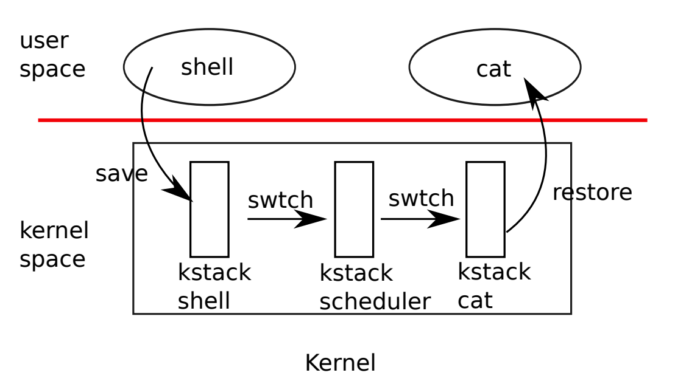

- [Lecture 11 : Thread Switching](#lecture-11--thread-switching)
  - [Book Reading : Chapter 7 Scheduling](#book-reading--chapter-7-scheduling)
    - [7.1 Multiplexing](#71-multiplexing)
    - [7.2 Code : Context switching](#72-code--context-switching)
    - [7.3 Code: Scheduling](#73-code-scheduling)
  - [Class](#class)
    - [11.1 线程概述](#111-线程概述)
    - [11.2 XV6线程调度](#112-xv6线程调度)
    - [11.3 XV6线程切换（一）](#113-xv6线程切换一)
# Lecture 11 : Thread Switching
Preparation: Read "Scheduling" through Section 7.4, and kernel/proc.c, kernel/swtch.S

[Lab](https://github.com/JasonJ2021/6.S081/blob/main/Lec11%20Thread%20Switching/lab.md)

## Book Reading : Chapter 7 Scheduling

### 7.1 Multiplexing

Xv6通过在每个CPU上从一个进程执行切换到另外一个进程执行实现多路复用。它发生在以下两种情况：
- sleep & wakeup机制。当一个进程等待设备或者Pipe I/O完成，或者wait child process exit , or wait in the sleep system call.
- xv6周期性的强制切换，使长时间执行的进程"休息".

多路复用给每个进程提供了一个假象：它独占了CPU资源和内存资源

实现多路复用带来了以许多挑战性：
1. 如何从一个进程切换到另外一个进程？
2. 如何在一个进程运行了一段时间后强制切换进程？Xv6使用timer interrupt
3. 所有的CPU切换都使用相同的进程集(在xv6具体实现中抽象表现为进程数组)，因此需要加锁来避免race condition
4. 当一个进程exit后，它必须释放所有的内存空间，但是它不能释放它自己的kernel stack在还使用的时候
5. 在一个多核处理器上，系统调用可能会并行运行在其他核上，因此它要知道它应该返回|改变哪个进程的状态
6. sleep & wakeup允许一个进程放弃CPU然后等待被唤醒，因此这里也有race condition

### 7.2 Code : Context switching

每个CPU上有一个单独的schduler线程，有对应的kernel stack.

当进行进程切换的时候，kernel 会调用swtch函数，保存现有进程的上下文，然后加载进scheduler的上下文。

swtch不会保存PC值，但是它会保存ra register，存放了swtch的返回地址。之后swtch加载scheduler线程的寄存器数据，切换到cpu->scheduler

### 7.3 Code: Scheduling
swtch函数实际上是从一个进程的内核线程 通过 scheduler线程到另外一个进程的通道。

一个想要离开CPU的进程必须先获取它的进程锁，释放它其他的锁，然后更新它的状态到runnable,最后调用 sched.在Sched 中重复进行检查上面这些条件是否满足。因为这时候有一个锁被获得了，因此Interrupt应该是关闭的。然后Sched调用scheduler函数来调度进程。

## Class

### 11.1 线程概述
线程和进程的差别
进程：是操作系统对运行程序的抽象，是资源分配的最小单位
线程：是进程的子任务，是CPU调度和分派的基本单位，用于保证程序的实时性，实现进程内部的并发

为什么我们需要进程？
- 我们希望计算机分时复用，比如允许在同一时间运行许多任务
- 多线程可以让程序的结构变的简单，例如lab1 中prime number
- 多线程可以进程并行运算，如果有4个核，理想的状态是可以把运算任务拆开为4个部分，这样就获得了4倍的运算速度

所以线程可以认为是单个串行执行代码的单元，只占用一个CPU并且以普通的方式一个接一个的执行指令。

线程还有状态context

1. 程序计数器
2. 保存变量的寄存器
3. Stack，每个线程都有属于自己的stack.

        struct context {
        uint64 ra;
        uint64 sp;
        ...
        caller - saved register

操作系统中的线程系统就是管理多个线程的运行，多线程的并行运行主要有两个策略：

- 第一个策略是在多核处理器上使用多个CPU，每个CPU可以运行一个线程
- 第二个策略是一个CPU在多个线程之间来回切换

当多个线程运行在共享的内存空间时，我们就需要锁。

xv6内核共享了内存，并且xv6支持内核线程的概念，每一个用户进程都有对应的内核线程。

### 11.2 XV6线程调度
实现线程管理系统有以下挑战：
- 线程之间如何切换？
- 线程切换的时候，必须保存并恢复线程的状态
- 如何处理密集型线程(compute bound thread).当一个线程已经运行好久了，怎么让他强制让出CPU

第三个问题是利用定时器中断，在每个CPU核上，都有一个timer,会定时产生timer interrupt.XV6会把这个interrupt传到kernel中，然后中断处理程序会自愿把CPU出让给scheduler(yield).

这样的处理流程称为pre-emptive scheduling.与之相反的是voluntary scheduling

我们需要区分几类线程
- 当前正在CPU上运行的线程
- 想要在CPU上运行的线程
- 暂时不想在CPU上运行的线程，等待I/O事件中...

他们分别对应了Running , Runnable , Sleeping.

### 11.3 XV6线程切换（一）

