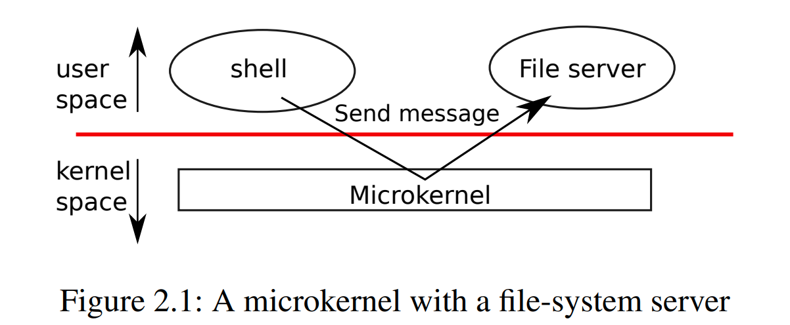
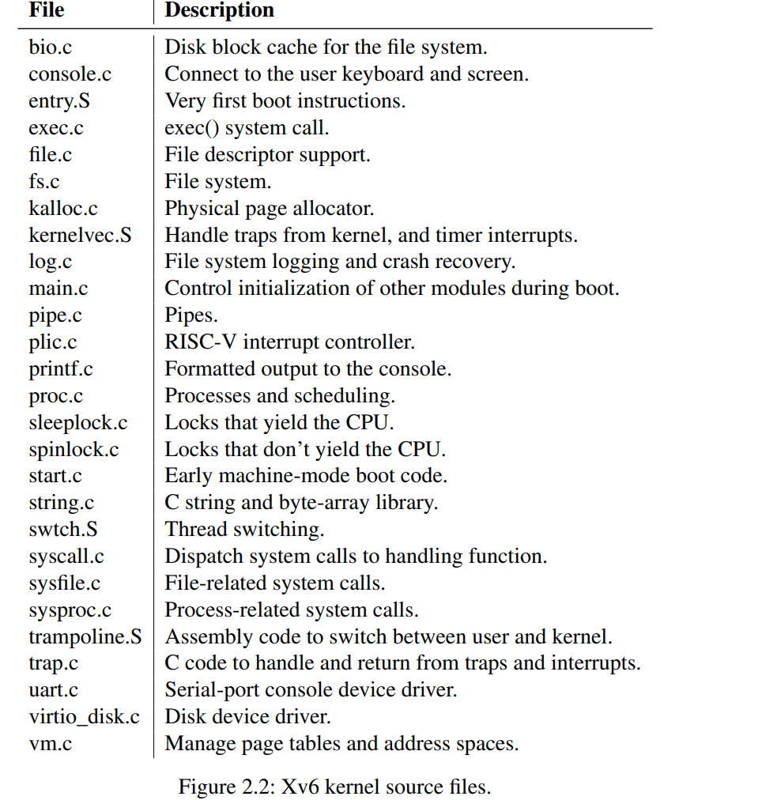
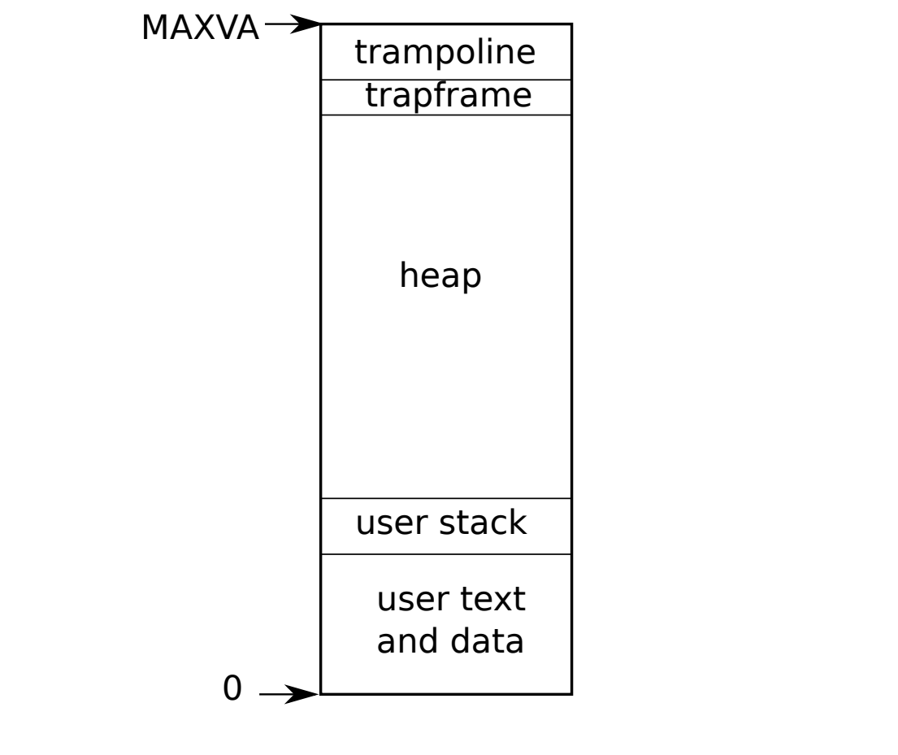
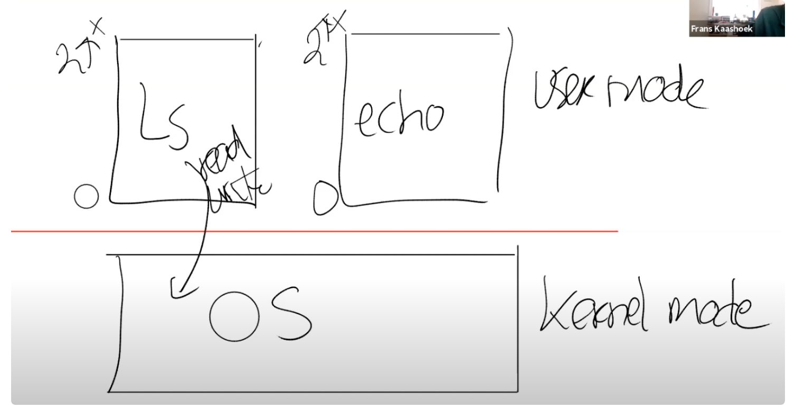
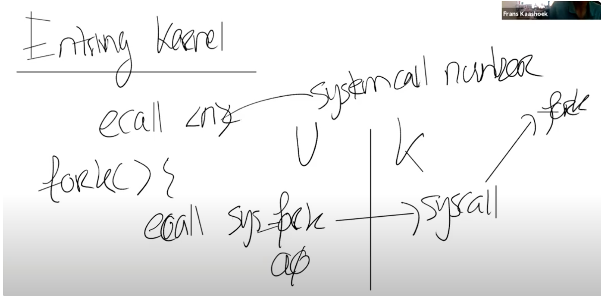
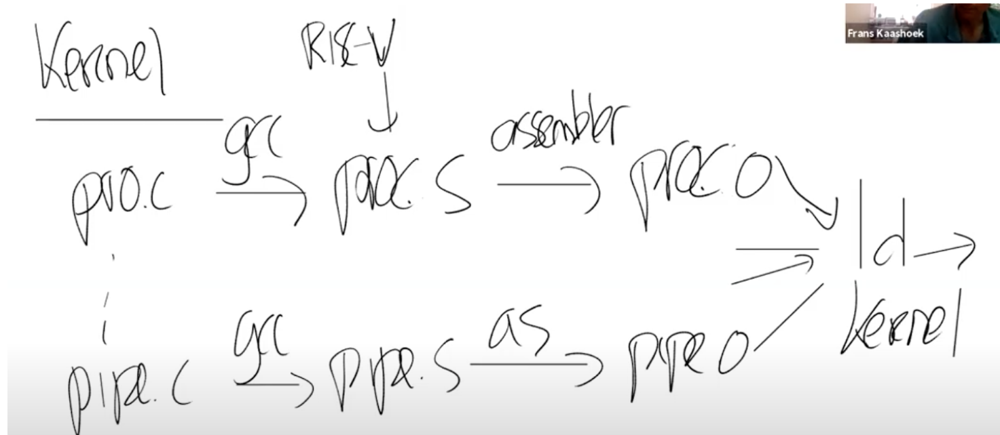
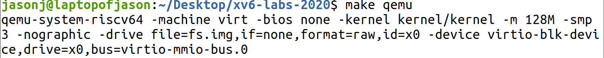
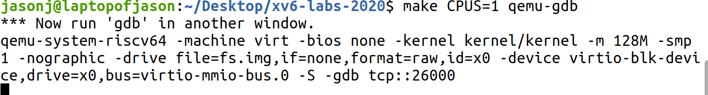
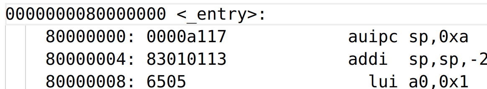

- [Lecture 3 : Operatin system organization and system call](#lecture-3--operatin-system-organization-and-system-call)
  - [Book reading](#book-reading)
    - [2.1 Abstracting physical resources](#21-abstracting-physical-resources)
    - [2.2 User mode , supervisor mode , and system calls](#22-user-mode--supervisor-mode--and-system-calls)
    - [2.3 Kernel organization](#23-kernel-organization)
    - [2.4 Code:xv6 organization](#24-codexv6-organization)
    - [2.5 Process overview](#25-process-overview)
    - [2.6 Code:starting xv6 , the first process and system call(精彩重点)](#26-codestarting-xv6--the-first-process-and-system-call精彩重点)
    - [2.7 Security Model](#27-security-model)
  - [Code Reading](#code-reading)
    - [kernel/proc.h](#kernelproch)
    - [kernel/defs.h](#kerneldefsh)
    - [kernel/entry.S](#kernelentrys)
    - [kernel/main.c](#kernelmainc)
    - [user/initcode.S](#userinitcodes)
    - [user/init.c](#userinitc)
  - [Class](#class)
    - [3.1 Preview](#31-preview)
    - [3.2 Isolation](#32-isolation)
    - [3.3 Defensive](#33-defensive)
    - [3.4 硬件对强隔离的支持](#34-硬件对强隔离的支持)
    - [3.5 User/Kernel mode switch](#35-userkernel-mode-switch)
    - [3.6 Monolithic Kernel vs Micro Kernel](#36-monolithic-kernel-vs-micro-kernel)
    - [3.7 编译运行kernel](#37-编译运行kernel)
    - [3.8 QEMU](#38-qemu)
    - [3.9 XV6启动过程](#39-xv6启动过程)
# Lecture 3 : Operatin system organization and system call
[Lab](https://github.com/JasonJ2021/6.S081/blob/main/Lec3%20Syscall/lab.md)
## Book reading
操作系统一个重要的目标就是支持多个1程序同时运行。例如，第一章提到的system call : fork() , 可以开启一个新的进程。同时操作系统必须*time share*硬件资源，也就是说，即使进程比CPU多，操作系统也要保证每个进程都有机会去运行。操作系统还要保证一个进程出错不会影响到其他进程。但是呢，完全isolation也是不行的，因为不同进程之间可能会进行交互,pipeline管道就是一个例子。这就是操作系统的三个目标：
- multiplexing
- isolation
- interaction

这一章的内容介绍了操作系统是如何实现这些目标的，专注于monolithic kernel(集成式核心，也就是说只有一个kernel,kernel运行在kernel space)
xv6用LP64 C写的，long and pointer are 64 bits,while int is 32 bits

### 2.1 Abstracting physical resources
在第一章我们发现，如果只需要运行一个程序，根本不需要操作系统。可以把系统调用函数打包为库，供其适用。但是，如果有多个程序，什么时候释放硬件资源？
因此我们把硬件资源抽象为接口，使应用程序与硬件资源分开。例如，应用程序只能通过open,read ,write,close来storage交互，而不是和disk直接交互。通过实现file system,应用程序只需要直到pathname,而操作系统(这个接口的实现者)可以管理磁盘。
类似的，操作系统透明地切换不同进程，保存和加载寄存器状态，这样应用程序不需要担心time sharing 的问题.
另一个例子是exec,Unix进程使用exec来创建内存镜像，而不是直接与物理内存交互。因此操作系统可以决定把进程放到哪里。

### 2.2 User mode , supervisor mode , and system calls
我们不希望一个进程崩溃而影响操作系统和其他进程，因此操作系统和应用程序之间需要有很强的界限，防止应用程序修改操作系统的指令和数据结构。
CPU提供了对Isolation的硬件支持，例如RISC-V 有三个模式：machine mode , supervisor mode , user mode.在machine mode中，有所有权限，cpu开启时是这个模式，通常用于配置一台计算机。xv6在machine mode执行一些代码然后切换到supervisor mode.
在supervisor mode,CPU可以执行一些高权限指令，例如：enabling and disabling interrupts.从寄存器读页表的地址等等.
如果一个应用程序试图执行这些指令，CPU会忽略并且把这个进程关闭.一个运行在supervisor mode中的程序运行在kernel space中，也就是说内核运行在supervisor mode中
CPU提供了一个特殊的指令让CPU从user mode 进入到supervisor mode,(RISC-V 使用ecall).一旦CPU进入了supervisor mode,内核就可以检查传给system call的地址是不是应用程序的一部分，检查应用程序是否被允许去write the specified file，拒绝或者执行。

### 2.3 Kernel organization
操作系统的一个核心设计问题就是操作系统的哪些部分应该运行在supervisor mode.xv6使用monolithic kernel , 整个kernel都运行在supervisor mode.
在集成式kernel中，一个错误是非常严重的。会导致整个内核停止运行，所有程序停止运行，必须重启才行。
还有一种架构是microkernel

这种架构可以保持kernel的相对简单，因为大部分的系统都放在了user-level server上了。
没有一个定论判断两种架构的优劣，但是可以从性能，代码大小，内核可靠程度，整个操作系统的可靠程度(包括用户级的server)
### 2.4 Code:xv6 organization

### 2.5 Process overview
xv6 对isolation的支持单元是process进程。这个抽象可以防止一个进程破坏其他进程的内存，CPU和文件描述符，同时也可以防止破坏内核。
内核对进程的实现机制有：user/supervisor mode flad,address spaces,time-slicing of threads;
为了加强isolation,进程抽象提供了一个假象给程序：它拥有属于它自己的私有计算机。通过地址空间，赋予了进程一个私有的memory sestem,别的进程无法读写。同时进程提供程序好像一个独立的CPU来执行它的指令
Xv6使用页表(由硬件实现)来给每个进程以独立的地址空间。RISC-V的页表把一个虚拟地址翻译为一个物理地址
xv6给每一个进程都提供了一个独立的页表，定义了它的地址空间

虚拟地址空间如图所示
依次为程序指令，全局变量，栈、堆空间(for malloc),有许多因素会限制进程地址空间的最大大小。虽然RISC-V的指针是64位的，硬件只能用它的低39位来查找虚拟地址，而xv6只能用38为，因此最大的地址为$2^{38}-1 = 0x3fffffffff$
在这个虚拟地址的最上面有两页比较特殊的，tramfram 和trampoline.trampoline里面保存了user 切换到内核的代码,而trapframe保存了进程的一些状态
xv6内核保存了许多不同进程的信息在struct proc(kernel/proc.h:86).一个进程最重要的状态包括：页表，内核栈，它的运行状态。我们使用p->xxx来指代proc structure的内容。p->pagetable，是一个指向进程页表的指针
每个进程都有一个执行线程，一个线程可以被挂起之后再继续运行。
每个进程有两个栈：用户栈和内核栈(p->kstack).当进程运行用户指令时候，它的kernel stack是空的。当一个进程进行系统调用后或是异常，内核代码运行在这个进程的内核栈上,内核栈上的数据是被保护起来的，因此当这个进程用户栈被破坏后，内核仍然能够运行
一个进程可以使用ecall来进行系统调用，它提升了硬件的权限，把PC更改到内核定义的entry point.entry point里面的代码可以切换到kernel stack然后执行内容指令。系统调用结束之后，使用sret来降低硬件权限，返回到用户层面。
p->state 指明了进程被分配，准备运行，运行或者等待IO，退出
在xv6中，一个进程由一个地址空间和一个线程组成

### 2.6 Code:starting xv6 , the first process and system call(精彩重点)
见XV6BOOK

### 2.7 Security Model

## Code Reading
### kernel/proc.h
内核上下文进程切换时，需要保存kernel的上下文信息，存放在context结构中，包括栈指针，返回地址和一些被调用者保存的寄存器.

    struct cpu {
      struct proc *proc;          // The process running on this cpu, or null.
      struct context context;     // swtch() here to enter scheduler().
      int noff;                   // Depth of push_off() nesting.
      int intena;                 // Were interrupts enabled before push_off()?
    };
cpu结构保存了当前运行的进程结构，上下文，noff是push_off()的深度，push_off和push_on是用来决定是否接受中断的，但他们必须匹配，也就是说两个push_off必须有两个push_on

进程的中断处理程序在tranpoline.S中，而它所需要的数据存放在tranpoline下面的trapframe页表中。
sscratch 寄存器中的指针指向trapframe.
tranpoline.S:
- uservec用来切换到kernel，它把用户寄存器数据存放到trapfram,并读取trapframe中kernel寄存器的数据,kernel_sp, kernel_hartid, kernel_satp, 然后跳转到kernel_trap;
- usertrapret() and userret()用来从kernel中返回，把内核寄存器的数据保存到trapframe中

enum procstate { UNUSED, SLEEPING, RUNNABLE, RUNNING, ZOMBIE };
procstate定义了进程的状态，
枚举使用方式

      enum DAY
      {
            MON=1, TUE, WED, THU, FRI, SAT, SUN
      };
      
      int main()
      {
          enum DAY day;
          day = WED;
          printf("%d",day);
          return 0;
      }

进程结构：

    struct proc {
      struct spinlock lock;

      // p->lock must be held when using these:
      enum procstate state;        // Process state
      struct proc *parent;         // Parent process
      void *chan;                  // If non-zero, sleeping on chan
      int killed;                  // If non-zero, have been killed
      int xstate;                  // Exit status to be returned to parent's wait
      int pid;                     // Process ID

      // these are private to the process, so p->lock need not be held.
      uint64 kstack;               // Virtual address of kernel stack
      uint64 sz;                   // Size of process memory (bytes)
      pagetable_t pagetable;       // User page table
      struct trapframe *trapframe; // data page for trampoline.S
      struct context context;      // swtch() here to run process
      struct file *ofile[NOFILE];  // Open files
      struct inode *cwd;           // Current directory
      char name[16];               // Process name (debugging)
    };

每个进程都有一个互斥锁。

### kernel/defs.h
是所有kernel可以使用函数结构的头文件

### kernel/entry.S
qemu会把kernel加载到0x80000000位置，kernel.ld会把entry.S代码放在这个位置上.而每个CPU开始都会跳转到这个位置
entry.S创建了一个栈空间，让c语言代码能够运行,然后跳转到start.c,start代码主要作了一些初始设置，然后跳转到main函数中。

### kernel/main.c
main.c首先初始化一些设备和子系统，然后通过调用userinit来创建第一个进程
(第一个CPU完成这些事件,其他的cpu先进入循环，等待完成配置再开启)

### user/initcode.S
这里已经运行在user mode

     exec(init, argv)
    .globl start
    start:
            la a0, init
            la a1, argv
            li a7, SYS_exec
            ecall
initcode.S首先把exec的number(SYS_EXEC)装在到a7中，然后通过ecall返回到内核中处理系统调用。内核把init process的内存和寄存器更换成init.c程序

### user/init.c
    if(open("console", O_RDWR) < 0){
        mknod("console", CONSOLE, 0);
        open("console", O_RDWR);
      }
打开console作为fd 0代表stdin
之后dup()两次，打开stdout和stderr
进入循环，打开一个子进程运行shell程序,然后父进程进入循环，等待子进程返回，如果返回了wpid = pid ，那么break,重启shell.报错则关闭init进程。

## Class
Today's topic :
- Isolation.隔离性是设计操作系统组织结构的驱动力
- Kernel和User mode.
- System calls.
- xv6
### 3.1 Preview
- Shell、echo、find等应用程序，运行在操作系统之上
- 操作系统抽象了一些硬件资源，比如CPU和磁盘
- 操作系统和应用系统之间的接口被称为SYSTEM CALL INTERFACE

### 3.2 Isolation
应用程序之间，应用程序和操作系统之间都需要隔离性.
为了不变成一个恶意程序，Shell在发现自己运行了一段事件后，需要让别的程序也有机会去运行。这种机制称为协同调度(Cooperative Scheduling).如果没有OS，shell进入了一个死循环，就不会释放CPU资源。
同样的，如果没有操作系统，不同程序之间内存都可以互相访问，会造成很大问题。
因此，使用操作系统的主要原因可以说就是实现multiplexing和memory isolation

下面我们从接口的角度理解隔离
fork:创建了内存，但是进程本身不是CPU，它们对应了一个CPU，使得能够在CPU上运行计算任务。因此，程序并不能直接与CPU互动，只能和进程交互。kernel会完成不同进程在CPU上的切换。进程抽象了CPU

exec:我们可以说exec抽象了内存，使用exec系统调用的时候，我们传入了一个文件名，它对应了一个应用程序的内存镜像。应用程序可以不断地拓展自己的内存空间，但是应用程序不能直接访问物理内存。

files:抽象了磁盘。应用程序不能直接读取磁盘本身，通过files我们可以对文件命名，读写文件。操作系统会决定如何将文件和磁盘对应，确保一个磁盘块只出现在一个文件中，确保A不能操作B的文件。file实现了多用户之间和同用户不同进程之间的文件强隔离。

### 3.3 Defensive
操作系统需要能够应对恶意的应用程序。
同时应用程序不能够打破对它的隔离。
通常来说，需要通过硬件来实现这强隔离性，包括两个部分：user/kernel mode 和 page table(virtual memory)

### 3.4 硬件对强隔离的支持
kernel mode下，CPU可以运行privileged instructions.而user mode只能运行普通权限的指令
普通权限的指令例如,ADD、SUB、JRC、BRANCH，所有应用程序都允许执行这些指令.
特殊权限指令主要是一些直接操纵硬件和设置保护的指令，例如设置page table 寄存器，关闭时钟中断。
e.g.:当一个应用程序尝试执行一条特殊权限指令，处理器会拒绝执行，然后从user mode switch to kernel mode , 然后可能会杀死该进程。

page table的存在可以让隔离应用程序的内存，每个进程都有一个page table,而且他们虚拟内存对应的物理内存是互不重和的。

### 3.5 User/Kernel mode switch
kernel mode和user mode分隔了用户和内核的边界。

需要有一种方式可以让应用程序把控制权交给内核(entering kernel)
RISC-V提供了ECALL指令，它接收一个数字参数，代表想要调用的SYSTEM CALL
ECALL会跳转到内核中一个特定的由内核控制的位置。XV6存在一个唯一的系统调用的接入点。
e.g.fork()函数并不是直接调用系统调用，而是把fork对应的SYSTEM_NUMBER传送给ECALL

有一个syscall函数，每一个系统调用都会调用到这个函数，它会检查ECALL的参数，通过这个参数内核可以直到调用的是fork

### 3.6 Monolithic Kernel vs Micro Kernel
TCB = Trusted Computing Base.
kernel一定要是TCB，否则会被恶意程序利用
宏内核(monolithic kernel)是让整个操作系统服务都在kernel mode中运行。
- 缺点：平均3000行就会有几个Bug,所以如果由许多行代码运行在内核中，出现Bug的可能性会比较大。
- 优点：子模块现在都在一个程序中，可以紧密地集成在一起。
  
微内核(Micro kernel)把许多服务都放在了user space
一个应用程序需要进行系统调用，例如exec的时候，会发送一个消息给内核，内核通知FS,FS之后再把完成的结果消息发给kernel,kernel再传递给应用程序。
因此我们看出micro kernel最大的问题是性能问题。

### 3.7 编译运行kernel
xv6代码结构：
- kernel. ls kernel 可以看到kernel包含了基本所有的内核文件，xv6是一个宏内核文件，因此所有文件会被编译成一个kernel的二进制文件，然后kernel运行在kernel mode.
- user:基本上是运行在user mode的内容
- mkfs:创建一个空的文件镜像，存放在磁盘上，可以使用一个空的文件系统

编译过程：
首先,makefile会读取一个c文件，例如prog.c,然后gcc编译器把它编译为prog.s(RISC-V汇编文件).然后调用汇编器解释为prog.o
Makefile会对所有kernel文件做这个操作，最后Loader会把这些.o文件链接为一个可执行文件.

Makefile还会创建kernel.asm，它是内核完整的汇编语言文件。
执行make qemu

这里可以看到传给qemu的参数
- -kernel kernel/kernel传送了内核文件
- -m 使用的内存大小
- -smp 使用的内核数量
- -drive 传送的是虚拟机使用的磁盘驱动，这里是fs.img

### 3.8 QEMU
QEMU是一个大型软件，仿真了RISC-V主板.在QEMU的主循环中，只做一件事情：
- 读取4/8字节的RISC-V指令
- 解析指令
- 在软件中执行相应的指令
为了完成工作，QEMU会有以C语言声明的寄存器

### 3.9 XV6启动过程
首先启动gdb,本质来说QEMU内部有一个gdb server,启动之后QEMU会等待gdb客户端连接

再输入

    gdb-multiarch kernel/kernel

从kernel.asm中可以读出程序的入口在0x80000000
