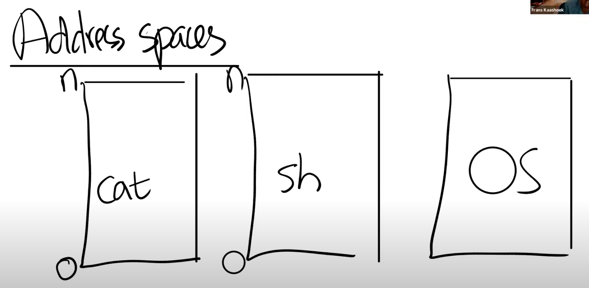

- [Lecture 4:Page tables](#lecture-4page-tables)
  - [Book Reading : Chapter 3](#book-reading--chapter-3)
    - [3.1 Paging hardware](#31-paging-hardware)
    - [3.2 Kernel address space](#32-kernel-address-space)
    - [3.3 Code : creating an address space](#33-code--creating-an-address-space)
    - [3.4 Physical memory allocation](#34-physical-memory-allocation)
    - [3.5 物理内存分配](#35-物理内存分配)
    - [3.6 进程地址空间](#36-进程地址空间)
    - [3.7 Code:sbrk](#37-codesbrk)
    - [3.8 Code:exec](#38-codeexec)
    - [3.9 Real world](#39-real-world)
  - [Class](#class)
    - [4.1 课程内容简介](#41-课程内容简介)
    - [4.2 地址空间(Address Spaces)](#42-地址空间address-spaces)
    - [4.3 页表(Page Table)](#43-页表page-table)
    - [4.4 页表缓存(Translation Lookaside Buffer , TLB)](#44-页表缓存translation-lookaside-buffer--tlb)
    - [4.5 Kernel Page Table](#45-kernel-page-table)
# Lecture 4: Page tables

## Book Reading : Chapter 3
页表提供了对每一个进程私有的地址空间和内存
xv6的页表实现了一些小技巧：
- 把一些相同的内存(tranpoline memory)映射到不同的地址空间
- 使用unmaped page来保护内核和用户栈

### 3.1 Paging hardware
RISC-V指令操纵虚拟地址，而机器的RAM，物理内存,is indexed with physical address.页表则把虚拟内存映射到物理内存。
XV6运行在Sv39 RISC-V上，意思是虚拟内存的64为只有后面的39位被使用。在这个架构上，页表是一个有$2^{27}$大小的PTE(page table entries)数组.每个PTE包含了一个44位的PPN(Physical page number)和一些flags.页表硬件取出虚拟地址后39位中的前27位作为PTE的index,然后取出对应PTE中的44位PPN，加上虚拟地址后12位，组成一个56位的物理地址。
我们可以从上面的过程发现，一个页的大小是4096($2^{12}$)bytes

SV39架构使用了三级页表,
.png)
虚拟地址中27位的前中后9位分别指向了在三级page中的PTE位置。
第一层结构是一个4096-byte page-table page,它有512个PTE,每个PTE的PPN指向下一个level的一个Page所在的物理内存位置.第二层page，通过PPN+VA中9位找到final level中PTE位置。最后一层的page通过末9位来寻找最终的PPN。
> 如果三个PTE中有任何一个翻译失败，会调用缺页异常

三级页表结构一个可能的缺点是，CPU必须加载三个PTE。为了避免面这个开销，RISC-V CPU有一个cache,存储了page table entries.Translation Look-aside Buffer(TLB)
PTE的后10位定义了相关的虚拟地址权限：

PTE_U定义了user mode下能不能访问这个PTE(flags and other page hardware -related structures 被定义在 kernel/riscv.h)
为了告诉硬件如何使用页表，kernel必须把根目录写到satp寄存器中，每个CPU都有自己的register,这样就实现了不同CPU运行不同进程的目的。
内核通常会把所有物理内存都映射到虚拟内存中
Kernel虚拟内存结构

### 3.2 Kernel address space

Xv6为每个进程保持了一个页表，同时也为内核保持了一个页表.
The file(kernel/memlayout.h)声明了xv6内核memory 的一些常量(如图所示).
Kernel使用direct mapping , i.e.virtual address = physical address.
有一对kernel虚拟地址是不被直接映射的
- trampoline page.它被放在kernel虚拟空间的最上面。和所有的进程映射到同一个位置。
- Kernel Stack.这样可以方便于在kernel stack下面放一些guarded page.guarded page被设置为PTE_U

Kernel的trampoline和kernel textPTE权限为R，X.其它都为R 、W.

### 3.3 Code : creating an address space
大部分xv6来操控地址空间和页表的代码在vm.c(kernel/vm.c)
核心的数据结构是pagetable_t，它是一个指向根页表页的指针
> typedef uint64 *pagetable_t; // 512 PTEs

核心的函数是walk()和mappages().
- walk用来为一个虚拟地址寻找PTE
- mappage创建一个PTE来建立新的映射

kvm开头的函数用来操作kernel页表
uvm开头的函数用来操作user 页表
其他的函数都可以操作
copyout 和copyin把内核中的数据copy to and from user virtual addresses.

main 会调用kvminithart来安装kernel pagetable,它会把根页表地址写到satp中

### 3.4 Physical memory allocation
看kalloc.c
kernel必须能够分配和释放物理内存，xv6使用PHYSTOP和end of kernel(kernel data 之后) 之间的物理内存来实现运行时分配，它会保持一个free page linked list，通过操作链表实现分配和释放

### 3.5 物理内存分配
kalloc.c

### 3.6 进程地址空间
每个进程都有一个独立的页表.
- 不同进程的页表把用户地址翻译为物理内存中不重复的地址
- 每个进程都把它的内存视为连续的且从0开始，但是实际上在物理内存中他们是不连续的
- kernel把相同的trampoline code 映射到每一个用户地址空间

为了监视一个用户栈是否溢出stack memory,xv6放了一个guard page(PTE_U = 0)在栈下面，如果stack overflow ，硬件会生成一个异常。在真实设计中，操作系统会自动分配更多内存给stack.

### 3.7 Code:sbrk
见代码
### 3.8 Code:exec
见代码
### 3.9 Real world
- xv6使用页表硬件来提供内存保护，大部分的现代操作系统会结合pageing 和缺页异常来实现paging
- 在xv6中，RAM的位置(0x8000000)是提前知道的.但是in real world,RAM的位置实际上是不可预测的。
- RISC-V提供物理地址级别的内存保护
- xv6内核缺少内存分配器(allocator)

## Class
### 4.1 课程内容简介
- 地址空间
- 支持虚拟内存的硬件
- xv6中的虚拟内存代码，内核地址空间和用户地址空间的结构

### 4.2 地址空间(Address Spaces)

图示有三个程序,sh , cat , kernel/os
我们期望每个程序都被装进一个盒子里面，他们不会彼此影响，并且与内核操作系统独立。
今天的课程，我们关注内存的隔离性。在RISC-V主板上，内存是由一些DRAM芯片组成的，保存了程序的数据和代码。所有程序都必须存在于物理内存中。
为了防止程序间互相影响，我们可以通过实现地址空间达到隔离的目的。

这样子，cat程序如果想要向地址1000写入数据，那么cat只会向自己进程属于的地址1000写入数据，而不是其他程序的1000地址。

### 4.3 页表(Page Table)
页表在硬件中通过处理器和内存管理单元(MMU)实现。
对于任何一条带有地址的指令，其中的地址应该被认为是虚拟内存地址。
e.g.

cpu正在执行一条命令sd $7 , (a0).把7写到a0存储地址的内存位置上
现在虚拟内存地址会被转到内存管理单元，将VA翻译为PA。之后这里地址空间会被用来索引物理内存，load or store data.
>从CPU的角度来说，MMU打开了，它执行的每条指令中的地址都是虚拟地址，我们在XV6代码可以看到这个实现。

为了实现地址翻译，MMU中会有一个表单，记录了从VA->PA的映射

通常来说，这个表单也会存储在内存中，所以CPU需要有一个寄存器来存放表单的物理地址。在RISC-V中，是SATP

每个进程都有自己的独立表但，定义了属于进程自己的地址空间。因此CPU从一个应用程序切换到另一个程序时候，也要切换SATP中的内容。
Risc-V的页表实现：
- 为每个page创建一条表单条目，每一次地址翻译都是针对一个page.在RISC-V中一个page的大小是$2^{12}$（4Kb = 4097Bytes）

对于虚拟内存，我们将它分为两个部分(index and offset).index用来寻找page,而offset对应page中的哪个字节
在RISC-V中，虚拟内存的地址是64bit,但是高25bit没有被使用，这样限制了虚拟内存的数量。剩下39bit,有27bit作为page index,12位作为offset.
物理内存的地址是56bit,44bit是物理page号（PPN，Physical Page Number),剩下12bit是VA's offset.
下面是RISC-V页表真正的实现方式：三级页表

Page Directory中的一个条目称为PTE

在PTE中前10位是一些标志位
- Valid = 1 表明是一条合法的PTE，可以用来做地址翻译。
- R/W 读写权限
- Executable可以从这个page执行指令
- User表明这个page可以被运行在用户空间的进程访问

在索引下一级Page directory时候，PPN会取相应PTE中的44位+12位0

### 4.4 页表缓存(Translation Lookaside Buffer , TLB)
几乎所有的处理器都会对最近使用的虚拟地址翻译结果有缓存，TLB会保存VA->PA的mapping
当我们切换page table时候，TLB必须刷新！
> RISC-V中的指令：sfence_vma

三级页表是由硬件实现的，但是有时候xv6也需要完成硬件的工作，因此实现了walk函数
>学生提问：在这个机制中，TLB发生在哪一步，是在地址翻译之前还是之后？
Frans教授：整个CPU和MMU都在处理器芯片中，所以在一个RISC-V芯片中，有多个CPU核，MMU和TLB存在于每一个CPU核里面。RISC-V处理器有L1 cache，L2 Cache，有些cache是根据物理地址索引的，有些cache是根据虚拟地址索引的，由虚拟地址索引的cache位于MMU之前，由物理地址索引的cache位于MMU之后。

### 4.5 Kernel Page Table

对主板插上电，主板做的第一件事情就是运行boot ROM上的代码，boot完成之后会跳转到0x80000000.
还有一些IO设备:
- PLIC(Platform-level Interrupt Controller)中断控制器
- CLINT(Core Local interruptor)中断的一部分
- UARTO(Universal Asynchronous Receiver)负责与Console和显示器交互
- VIRTIO disk 与磁盘进行交互

内核虚拟地址空间低于PHYSTOP的虚拟地址与物理地址是一样的.

有两件重要的事情：
- 你可以向同一个物理地址映射两个虚拟地址，你可以不将一个虚拟地址映射到物理地址。可以是一对一的映射，一对多映射，多对一映射。
  >有一些page在虚拟内存中的地址很靠后，比如kernel stack在虚拟内存中的地址就很靠后。这是因为在它之下有一个未被映射的Guard page，这个Guard page对应的PTE的Valid 标志位没有设置，这样，如果kernel stack耗尽了，它会溢出到Guard page，但是因为Guard page的PTE中Valid标志位未设置，会导致立即触发page fault，这样的结果好过内存越界之后造成的数据混乱。立即触发一个panic（也就是page fault），你就知道kernel stack出错了。同时我们也又不想浪费物理内存给Guard page，所以Guard page不会映射到任何物理内存，它只是占据了虚拟地址空间的一段靠后的地址。
- 权限，对于kernel text，只有R-X，对于kernel data 有 RW-

不同的进程会有对应的kernel stack
free memory用来存放用户进程的page table,text和data