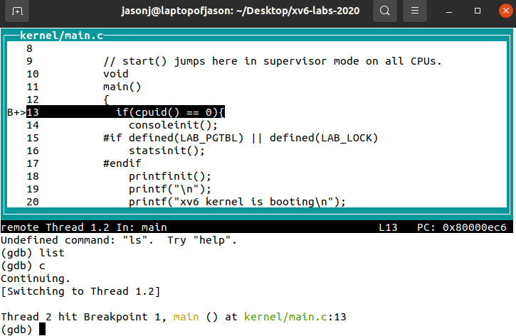
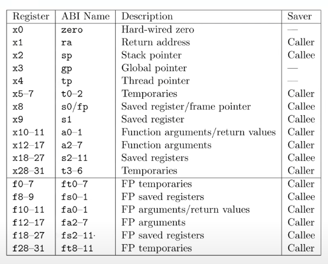
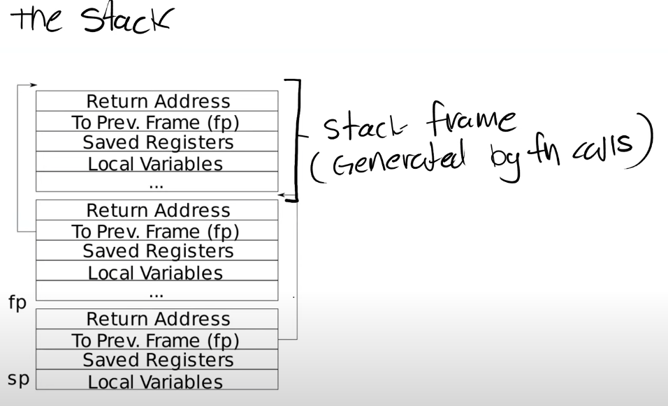
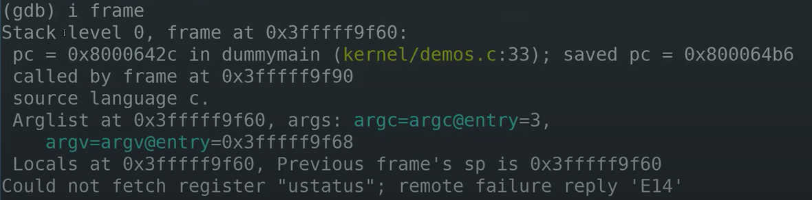
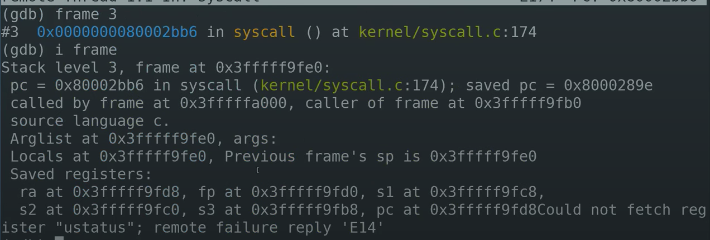

# Lecture 5:Calling conventions

## gdb和汇编代码执行
在gdb中输入tui enable可以打开源代码展示窗口

gdb右上角是程序计数器，可以去kernel.asm中查看

>layout asm 可以在tui窗口中看到所有的汇编指令
>layout reg 可以看到所有的寄存器信息

如果在跟踪代码时候忘了断点，可以使用info breakpoints
同样的，也可以使用info reg查看寄存器信息

tmux中会话、窗口、面板
一个会话可以包含多个windows,窗口默认充满会话界面，因此可以运行一些相关性不大的任务
一个windows可以包含多个面板，都处于同一界面下，因此可以运行相关性高的任务

一些tmux指令：
tmux 启动tmux
ctrl+b是激活控制台，所有tmux指令之前都要加
- c创建新窗口
- 数字键 切换至指定窗口
- p 切换上一窗口
- n 切换下一窗口
- " 将当前面板分为上下两块
- % 将当前面板分为左右两块
- 方向键 切换面板

## RISC-V寄存器

汇编代码不是在内存上执行而是在寄存器上执行，是用来进行任何运算和数据读取的最快方式
通常我们提到寄存器名字，指的是他们的ABI name,因为这样子更加清晰和标准，而且在写汇编代码的时候也是用ABI name.
a0-a7用来保存函数的参数，超过8个参数的时候会使用内存
- caller Saved在函数调用时候不会保存
- callee Saved在函数调用的时候会保存

## Stack

每一个区域都是一个栈帧，每执行一次函数调用就会产生一个栈帧
我们调用一个函数的时候，函数都会为自己创建一个STACK FRAME,通过移动STACK POINTER来完成空间分配。在创建一个新的栈帧时候，对sp做减法。
栈帧包含保存的寄存器，本地变量，函数的额外参数，因此栈帧的大小是不确定的。但是有两件事情确定：
- 返回地址总在最前面
- 指向上一个栈帧的指针也会出现在固定位置

stack frame中有两个重要的寄存器：
1. SP，指向Stack的底部，代表当前Stack Frame的位置。
2. FP，指向Stack的顶部，可以通过FP寄存器来寻址到返回地址和上个栈帧的指针

一个汇编函数的结构：
- Function prologue
- 本体
- Epilogue

prologue分配栈帧，epilogue恢复栈帧

>info frame //可以得到关于当前stack frame许多有用的信息

- Stack level 0 代表调用栈的最低层
- pc 当前的程序计数器
- saved pc , demo4的位置， 表明当前函数要返回的位置
- source language c 代表c语言代码
- Arglist at 表明参数的起始地址

输入backtrace(bt)可以看到从当前调用栈开始的所有stack frame

如果对某一个stack frame感兴趣，可以先定位到那个frame再输入info frame.

## Struct
你可以认为struct像一个数组，但是里面不同字段的类型可以不一样
