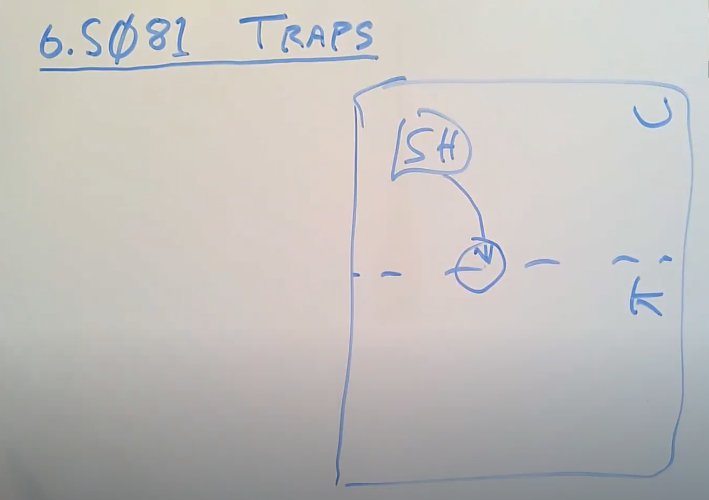
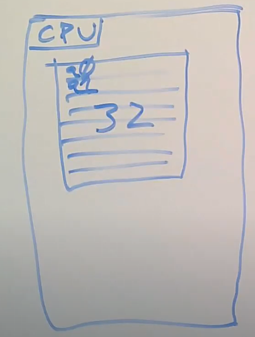
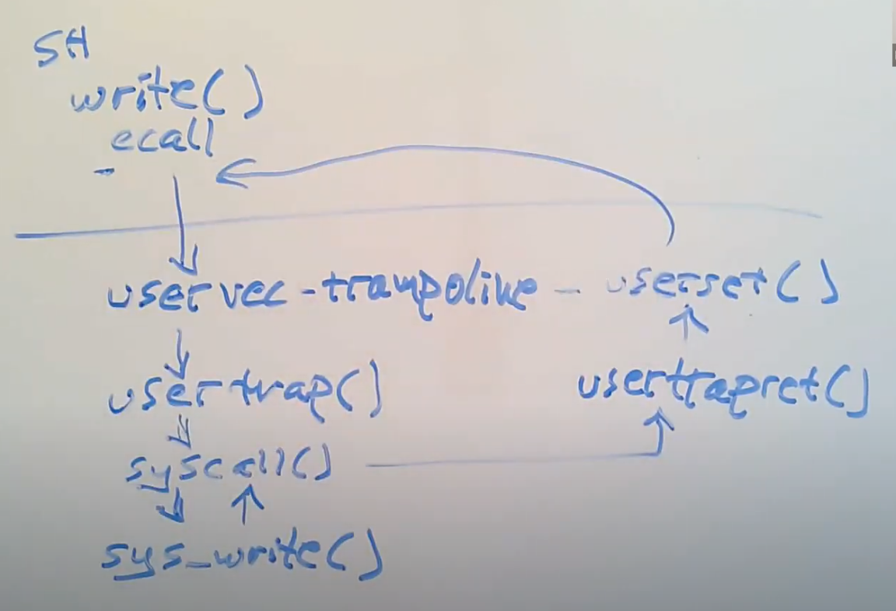
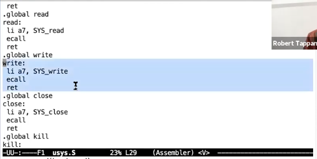
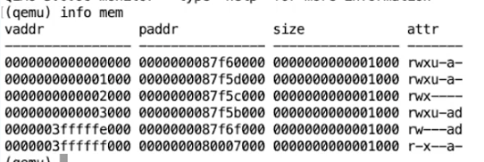
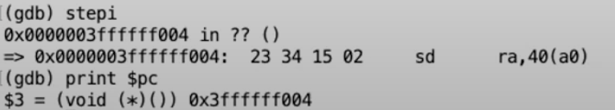
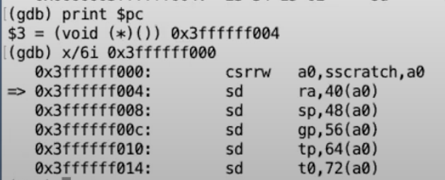

- [Lecture 5: system call](#lecture-5-system-call)
  - [Book Reading : Chapter 4 Traps and system calls](#book-reading--chapter-4-traps-and-system-calls)
    - [4.1 Risc-V trap machinery](#41-risc-v-trap-machinery)
    - [4.2 Traps from user space](#42-traps-from-user-space)
      - [usertrap()](#usertrap)
      - [usertrapret](#usertrapret)
    - [4.3 Code: Calling system calls](#43-code-calling-system-calls)
    - [4.4 Code:System call arguments](#44-codesystem-call-arguments)
    - [4.5 Traps from kernel space](#45-traps-from-kernel-space)
    - [4.7 Real World](#47-real-world)
  - [Lecture 6 :Isolation & system call entry/exit](#lecture-6-isolation--system-call-entryexit)
    - [6.1 Trap机制](#61-trap机制)
    - [6.2 Trap代码执行流程](#62-trap代码执行流程)
    - [6.3 ECALL指令之前的状态](#63-ecall指令之前的状态)
    - [6.4 ECALL指令之后的状态](#64-ecall指令之后的状态)
# Lecture 5: system call
[Lab](https://github.com/JasonJ2021/6.S081/blob/main/Lec6%20TrapAndSystemCALL/lab.md)
## Book Reading : Chapter 4 Traps and system calls
有三种事件会导致CPU放下原来的指令流，强迫把控制转移到特定的代码。
- System call: 一个用户程序执行ecall来调用system call
- exception:一个指令(user or kernel)做了一些非法的行为，例如除0 or 使用无效的VA.
- interrupt:一个设备想要“说”他需要CPU的”关注“,例如一个磁盘硬件完成了一个read or write的指令

这本书用trap作为一个适用于前面三种情况的通用形式，通常来说trap之后会继续执行原来的程序流。一般的流程：trap 强迫控制转移到kernel -> kernel 保存寄存器和一些状态以便于之后继续执行指令 -> kernel执行适当的handler code(e.g. a system call impletentation or device driver) -> kernel 恢复原来的状态 ， 然后从trap返回 -> original code 从原来停止的地方继续执行

xv6在kernel中处理所有的trap
- 对于system call 来说很自然
- 对于interrupt 实现了隔离性：只有kernel能够使用device
- 对于exception , kernel 还可以kill offending program

xv6 陷阱处理有四个阶段：
- CPU执行的硬件行为
- 一些汇编指令为去到kernel C code作准备
- 一个 C function 来决定如何处理这个trap
- 系统调用 或者 设备驱动服务例程

我们虽然可以用同一个代码路径来处理所有的trap,但是把三种情况分开处理比较方便：用户空间的trap , 内核空间的trap , 时钟中断

处理trap的kernel code(C or 汇编)通常被称为handler,第一个handler 通常被写为汇编语言，有时候被称为*vector*

### 4.1 Risc-V trap machinery
每个RISC-V CPU都有一系列的由内核写入的控制寄存器用来告诉CPU如何处理trap.
下面是一些比较重要的
- stvec:内核会把trap handler的地址写到stvec中.RISC-V跳转到这个地址来进行处理操作
- sepv:当一个trap发生的时候，RISC-V会把原来的PC值村到sepv，因为马上PC就会被stvec中的值替代. *sret*(return from trap)复制sepc的值到pc.
- scause: RISC-V会放一个数字在这里来描述产生trap的原因
- sscratch:内核放一个值，在trap handler刚开始的时候派上用场
- sstatus: SIE bit in sstatus controls whether device interrupts are enabled.如果清除了SIE位，device interrupt会被延缓到它被设置。 SPP bit 描述一个trap是从user mode 还是 supervisor mode产生的，同时控制sret返回时候的模式

以上的一些寄存器只能在supervisor模式下访问，还有一些控制寄存器是只能在machine mode访问，用于一些特殊的timer interrupts

When it needs to force a trap,RISC-V硬件作以下操作(所有trap types除了timer interrupts 都一样)：
1. 如果trap 是device interrupt,而且sstattus SIE bit is clear，以下操作都不做
2. clear the SIE bit in sstatus
3. copy pc to sepc
4. 保存当前的mode in the SPP bit in sstatus
5. 设置 scause 来反映trap cause
6. 更改模式到supervisor
7. 复制stvec 到 pc
8. 开始在新的pc值执行指令

CPU不会切换到kernel pagetable,不会切换到kernel中的栈，不会保存除了pc以外的寄存器值

### 4.2 Traps from user space
xv6处理trap的方式取决于trap产生在内核空间还是用户空间,这一节主要讲用户空间引起的trap.
用户空间的trap产生于系统调用(ecall),非法操作或者是设备中断。
用户空间trap的路径：uservec()->usertrap()
返回路径：usertrapret() ->userret

在xv6的设计中，用户空间的mapping不存在于kernel pagetable.而且当force a trap,pagetable(satp)没有进行切换.这也就意味着stvec在kernel pagetable和用户页表中都要进行映射。

xv6通过trampoline解决了上述限制，它在kernelpage和userpage都被映射了一次，而且位置相同。

uservec在trampoline.S中，内核把一个进程的p->trapframe地址存放在sscratch中,因此uservec首先使用trapframe来保存当前进程的寄存器信息。
> csrrw a0, sscratch, a0之后可以用a0为基址引用地址，而且之后a0可以作为一个自由寄存器使用

trapframe包含了当前进程的kernel stack,CPU-hartid,usertrap函数的地址,内核页表的地址.uservec在保存了32个寄存器之后，恢复这些值，把satp指向内核页表，然后调用usertrap.
#### usertrap()
在调用usertrap时候，*注意到这时候已经在kernel中了*。usertrap的主要任务是决定trap产生的原因，处理trap然后返回。它首先更改stvec到kernelvec,存储sepc（因为usertrap可能会call yield()切换到另外一个进程，这个进程可能会返回到用户空间然后更改sepc）
- 如果这个trap是系统调用，call syscall;需要把sepc+4到下一个指令
- 如果是device interrupt, devintr()
- 如果是exception , kill the process

#### usertrapret
首先用户空间的下一次trap作准备

      w_stvec(TRAMPOLINE + (uservec - trampoline));

      // set up trapframe values that uservec will need when
      // the process next re-enters the kernel.
      p->trapframe->kernel_satp = r_satp();         // kernel page table
      p->trapframe->kernel_sp = p->kstack + PGSIZE; // process's kernel stack
      p->trapframe->kernel_trap = (uint64)usertrap;
      p->trapframe->kernel_hartid = r_tp();         // hartid for cpuid()

包括：
- 把stvec重新指向uservec
- 更新p->trapframe中的kernel数据
- 更新sstatus
- 恢复spec
- 把userpage传送给userret

      uint64 satp = MAKE_SATP(p->pagetable);
      uint64 fn = TRAMPOLINE + (userret - trampoline);
        ((void (*)(uint64,uint64))fn)(TRAPFRAME, satp);

之后调用trampoline.S中的userret
userret恢复用户页表,恢复寄存器状态,最后保存trapframe到sscratch

### 4.3 Code: Calling system calls
下面来看一下系统调用的具体过程
user code会把系统调用的参数放在a0,a1寄存器，把系统调用号放在a7
然后使用ecall命令，traps into the kernel，执行uservec,usertrap,syscall

    void
    syscall(void)
    {
      int num;
      struct proc *p = myproc();

      num = p->trapframe->a7;
      if(num > 0 && num < NELEM(syscalls) && syscalls[num]) {
        p->trapframe->a0 = syscalls[num]();
      } else {
        printf("%d %s: unknown sys call %d\n",
                p->pid, p->name, num);
        p->trapframe->a0 = -1;
      }
    }
system call返回值存储在a0

### 4.4 Code:System call arguments
syscall中的argint,argaddr和argfd可以取出n'th 系统调用参数(在p->trapframe中保存)
如果系统调用传送了一个指针参数，kernel会使用copyin\copyinstr之类的函数(见pagetable章节)

### 4.5 Traps from kernel space
当运行在kernel时候，stvec指向kernelvec.
kernelvec与uservec略有不同，首先它在kernel thread的栈上存储寄存器，然后跳转到kerneltrap
kerneltrap只会处理exception和device interrupt两种trap.因为yield可能会改变sstatus和stpc，因此需要先保存后恢复。之后kerneltrap返回到kernelvec中

### 4.7 Real World
正如我们在pgtbl lab中完成的，真实的os可以通过每个进程拥有一个kernelpagetable来去除对trampoline的userpage mapping

## Lecture 6 :Isolation & system call entry/exit

### 6.1 Trap机制
今天讨论用户空间和内核空间的切换，它发生在三种情况
- 程序执行系统调用
- exception(e.g. page fault)
- device interrupt , 设备触发中断使得当前程序运行需要内核驱动

trap因为比较频繁，因此它的机制需要尽可能的简单。

下面以shell为例子介绍trap机制

shell可能会执行系统调用，将程序运行切换到内核。像输出"$ "这样的操作是由系统调用进行的。
从只有user权限并且位于用户空间的shell，切换到拥有supervisor权限的内核。在切换中，硬件的状态十分重要。我们关心32个用户寄存器.

用户应用程序尽量使用寄存器，因为他们的性能是最后好的。
此外还有一些control register.
- PC
- 表明当前mode的标志位，表明当前是supervisor还是user mode
- 控制CPU工作方式的寄存器，例如SATP(Supervisor address Translation and Protection),指向page table的物理内存地址
- STVEC(Supervisor Trap Vector Base Address Register),指向内核中处理trap的指令起始位置。
- SEPC(Supervisor Exception Program Counter),保存在进入trap之前的PC值，用于从trap中返回后PC的恢复
- SSRATCH，这个是一个十分重要的寄存器

接下来我们来预览一下需要做的操作。
- 保存32个用户寄存器，我们还想在trap处理完成之后继续运行用户程序
- 程序寄存器也需要被保存（在SEPC）
- 把权限提升到supervisor
- 在到内核运行内核程序的时候，需要把SATP指向kernel pagetable
- stack pointer需要指向一个真实存在的栈空间(有一些用户程序不存在stack)
- 设置完所有状态，硬件状态适合的时候跳入内核的C代码

下面讨论一下user mode 和 supervisor mode到底有什么区别
- 可以读写控制寄存器
- 可以使用PTE_U = 0的PTE，当PTE_U被设置之后，只有user code能够访问这类PTE

### 6.2 Trap代码执行流程

write函数通过ecall指令来进行系统调用，ECALL会切换到具有supervisor mode的内核。执行的第一个执行是uservec(kernel/trampoline.S),之后进入到trap.c(位于内核中)。在usertrap这个C函数中，执行了一个syscall的函数，调用内核中函数。
之后从内核中切出。

### 6.3 ECALL指令之前的状态
用户空间中write函数的实现

首先把SYS_write加载到a7,告诉内核我们要运行第16个系统调用，然后执行ecall.内核完成操作之后，代码会返回到用户空间继续执行ret.
a0 , a1 ,a2 存储了Shell传递给write系统调用的参数,a0是文件描述符2，a1是写入字符串的指针，a2是相要写入的字符数
>在QEMU界面,输入ctrl a + c可以进入QEMU的console，输入info mem, QEMU会打印出完整的pagetable

shell的pagetable比较小,最后两个pte分别是trapframe和trampoline,他们都没有设置PTE_U说明只有在进入supervisor状态之后才可以访问这个PTE

可以看一下satp,里面存储了当前pagetable的物理内存体制。

### 6.4 ECALL指令之后的状态
执行完ecall之后,

可以看到已经跳转到一个非常大的va了
而info mem可以看到此时的pagetable仍然是用户的.从上一节可以推断出此时我们在trampoline的最开始
实际上这时候在uservec(kernel/trampoline.S)中,
>ecall指令只是提升了权限,把PC保存在SEPC中,然后通过spvec寄存器的地址跳转到trap处理汇编函数中,这里是uservec

csrrw交换了a0和sscratch,sscratch存储了p->trapframe.

我们发现ecall指令只完成了少部分工作,这是因为RISC-V想为software提供最大的灵活性.

- 举个例子，因为这里的ecall是如此的简单，或许某些操作系统可以在不切换page table的前提下，执行部分系统调用。切换page table的代价比较高，如果ecall打包完成了这部分工作，那就不能对一些系统调用进行改进，使其不用在不必要的场景切换page table。
- 某些操作系统同时将user和kernel的虚拟地址映射到一个page table中，这样在user和kernel之间切换时根本就不用切换page table。对于这样的操作系统来说，如果ecall切换了page table那将会是一种浪费，并且也减慢了程序的运行。
- 或许在一些系统调用过程中，一些寄存器不用保存，而哪些寄存器需要保存，哪些不需要，取决于于软件，编程语言，和编译器。通过不保存所有的32个寄存器或许可以节省大量的程序运行时间，所以你不会想要ecall迫使你保存所有的寄存器。
- 最后，对于某些简单的系统调用或许根本就不需要任何stack，所以对于一些非常关注性能的操作系统，ecall不会自动为你完成stack切换是极好的。

接下来我们还需要完成:
- 保存32个用户寄存器
- 切换kernel pagetable
- 创建或者找到一个kernel stack,并且把sp指向这个地址
- 跳转到内核中trap处理函数

