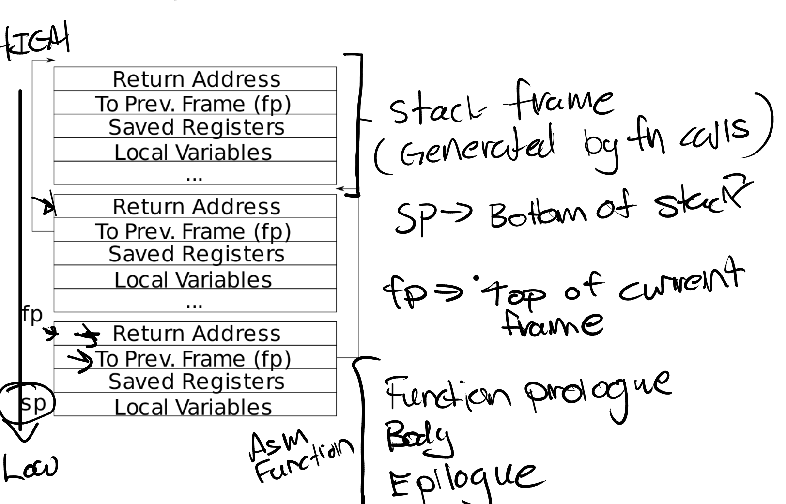

# Lab: Traps

## RISC-V assembly (easy)

### Risc-V指令
- addi rd1 , rd2 , imm :rd1 <-rd2+imm
- sd rg,mm ：把mm出数据加载到rg
- auipc rd, immediate :rd = pc + 立即数
- 

### Questions
make fs.img会产生call.asm,阅读这个汇编文件
>1.Which registers contain arguments to functions? For example, which register holds 13 in main's call to printf?

answer:a0,a1,a2

>2.Where is the call to function f in the assembly code for main? Where is the call to g? (Hint: the compiler may inline functions.)

answer:0x23,0x13处

>3. At what address is the function printf located?

answer:0x630

>4. What value is in the register ra just after the jalr to printf in main?

answer:0x30

>5. Run the following code.
	unsigned int i = 0x00646c72;
	printf("H%x Wo%s", 57616, &i);
      
发现输出HE110 World
i = ' ' , 'd','l','r'
因为risc-v是小端法把数据存储在内存中，所以int i 在内存中like:0x726c6400
-> r l d null

>6. printf("x=%d y=%d", 3);

通过查看qemu registers
x12/a2 0000000000000001
printf第三个参数没有赋值,此时存储在a2寄存器中的值是1，因此输出x=3 y=1

## Backtrace (moderate)
这个任务的要求是回溯现在在栈上的函数。
栈的结构如下：

fp - 1的位置是函数返回的地址
fp - 2的位置是上一个栈帧的地址
注意栈的大小就是一个page(4Kb),所以要限制fp的返回

    void backtrace(){
      uint64 fp = r_fp();
      while(fp < PGROUNDUP(fp)){
        uint64 addr = *((uint64 *)fp - 1);
        printf("%p\n",addr);
        fp = (uint64)(*((uint64 *)fp - 2));
      }
    }

## Alarm (hard)
这个任务要求我们实现一个系统调用sigalarm(interval, handler),在interval个时钟周期之后，调用handler
可以分为两个阶段：invoke handler & resume executing
我们还需要达到几个要求：
- 我们需要保持p->trapframe中的stored registers不变.所以需要在proc中保存trapframe中的寄存器值
- 在一个handler还没有返回的时候，不应该对它进行再次调用

两个系统调用：

	+// =====================Part 3====================
	+
	+uint64
	+sys_sigalarm(void){
	+  int interval;
	+  uint64 handler;
	+  struct proc *p;
	+  p = myproc();
	+  argint(0,&interval);
	+  argaddr(1,&handler);
	+  p->interval = interval;
	+  p->handler = handler;
	+
	+  p->hasreturned = 1;
	+  return 0;
	+}
	+
	+uint64
	+sys_sigreturn(void){
	+  struct proc *p;
	+  p = myproc();
	+  p->hasreturned = 1;
	+  
	+  p->trapframe->epc = p->pepc;
	+  p->trapframe->ra = p->ra ;
	+  p->trapframe->sp = p->sp;
	+  p->trapframe->gp = p->gp;
	+  p->trapframe->tp = p->tp;
	+  p->trapframe->t0 = p->t0;
	+  p->trapframe->t1 = p->t1;
	+  p->trapframe->t2 = p->t2;
	+  p->trapframe->s0 = p->s0;
	+  p->trapframe->s1 = p->s1;
	+  p->trapframe->a0 = p->a0;
	+  p->trapframe->a1 = p->a1;
	+  p->trapframe->a2 = p->a2;
	+  p->trapframe->a3 = p->a3;
	+  p->trapframe->a4 = p->a4;
	+  p->trapframe->a5 = p->a5;
	+  p->trapframe->a6 = p->a6;
	+  p->trapframe->a7 = p->a7;
	+  p->trapframe->s2 = p->s2;
	+  p->trapframe->s3 = p->s3;
	+  p->trapframe->s4 = p->s4;
	+  p->trapframe->s5 = p->s5;
	+  p->trapframe->s6 = p->s6;
	+  p->trapframe->s7 = p->s7;
	+  p->trapframe->s8 = p->s8;
	+  p->trapframe->s9 = p->s9;
	+  p->trapframe->s10 = p->s10;
	+  p->trapframe->s11 = p->s11;
	+  p->trapframe->t3 = p->t3;
	+  p->trapframe->t4 = p->t4;
	+  p->trapframe->t5 = p->t5;
	+  p->trapframe->t6 = p->t6;
	+  return 0;
	+}
在这里sigalarm其实就是一个记录器。
sigreturn为了能够返回到原来interrupted code，需要恢复原来的trapframe保存的寄存器值
trapframe->epc是返回到user space之后执行的pc值。

我们需要修改proc结构

	struct proc {
	struct file *ofile[NOFILE];  // Open files
	struct inode *cwd;           // Current directory
	char name[16];               // Process name (debugging)
	+
	+  // ==================== Part3 ========================
	+  int interval;
	+  uint64 handler;
	+  uint ticks;
	+  uint64 pepc;
	+  int hasreturned;
	+  /*  40 */ uint64 ra;
	+  /*  48 */ uint64 sp;
	+  /*  56 */ uint64 gp;
	+  /*  64 */ uint64 tp;
	+  /*  72 */ uint64 t0;
	+  /*  80 */ uint64 t1;
	+  /*  88 */ uint64 t2;
	+  /*  96 */ uint64 s0;
	+  /* 104 */ uint64 s1;
	+  /* 112 */ uint64 a0;
	+  /* 120 */ uint64 a1;
	+  /* 128 */ uint64 a2;
	+  /* 136 */ uint64 a3;
	+  /* 144 */ uint64 a4;
	+  /* 152 */ uint64 a5;
	+  /* 160 */ uint64 a6;
	+  /* 168 */ uint64 a7;
	+  /* 176 */ uint64 s2;
	+  /* 184 */ uint64 s3;
	+  /* 192 */ uint64 s4;
	+  /* 200 */ uint64 s5;
	+  /* 208 */ uint64 s6;
	+  /* 216 */ uint64 s7;
	+  /* 224 */ uint64 s8;
	+  /* 232 */ uint64 s9;
	+  /* 240 */ uint64 s10;
	+  /* 248 */ uint64 s11;
	+  /* 256 */ uint64 t3;
	+  /* 264 */ uint64 t4;
	+  /* 272 */ uint64 t5;
	+  /* 280 */ uint64 t6;
	};

在proc中添加这几个参数，tick(已经过去了几个时钟周期，用来判断触发handler),interval & handler(记录触发间隙和handler地址),hasreturned(记录handler是否返回),pepc(记录原来trapframe中的epc，用来继续执行user code),同时还记录了一大串的寄存器值.

我们还需要注意，在allocproc中需要初始化这个进程的一些参数。

     +  p->ticks = 0;
     +  p->hasreturned = 1;
        return p;

最后我们修改usertrap(kernel/trap.c)

     if(which_dev == 2){
     +      p->ticks++;
     +      if (p->ticks == p->interval)
     +      {
     +        if(p->hasreturned == 1 ){
     +          p->pepc = p->trapframe->epc;
     +          p->trapframe->epc = p->handler;
     +          p->hasreturned = 0;
     +          p->ra = p->trapframe->ra;
     +          p->sp = p->trapframe->sp;
     +          p->gp = p->trapframe->gp;
     +          p->tp = p->trapframe->tp;
     +          p->t0 = p->trapframe->t0;
     +          p->t1 = p->trapframe->t1;
     +          p->t2 = p->trapframe->t2;
     +          p->s0 = p->trapframe->s0;
     +          p->s1 = p->trapframe->s1;
     +          p->a0 = p->trapframe->a0;
     +          p->a1 = p->trapframe->a1;
     +          p->a2 = p->trapframe->a2;
     +          p->a3 = p->trapframe->a3;
     +          p->a4 = p->trapframe->a4;
     +          p->a5 = p->trapframe->a5;
     +          p->a6 = p->trapframe->a6;
     +          p->a7 = p->trapframe->a7;
     +          p->s2 = p->trapframe->s2;
     +          p->s3 = p->trapframe->s3;
     +          p->s4 = p->trapframe->s4;
     +          p->s5 = p->trapframe->s5;
     +          p->s6 = p->trapframe->s6;
     +          p->s7 = p->trapframe->s7;
     +          p->s8 = p->trapframe->s8;
     +          p->s9 = p->trapframe->s9;
     +          p->s10 = p->trapframe->s10;
     +          p->s11 = p->trapframe->s11;
     +          p->t3 = p->trapframe->t3;
     +          p->t4 = p->trapframe->t4;
     +          p->t5 = p->trapframe->t5;
     +          p->t6 = p->trapframe->t6;
     +        }
     +        p->ticks = 0;
     +        
     +      }
     +    }
which_dev是一个timer interrupt
判断handler是否已经返回，if(p->hasreturned = 1)，那么应该保存当前trapframe的值，然后准备返回到user space中执行handler的函数。

**不管handler有没有返回，达到interval之后我们都应该把ticks归零**