- [Lecture 8 :Page faults](#lecture-8-page-faults)
  - [Class](#class)
    - [8.1 Page fault Basics](#81-page-fault-basics)
    - [8.2 Lazy page allocation](#82-lazy-page-allocation)
    - [8.3 Zero Fill on Demand](#83-zero-fill-on-demand)
    - [8.4 Copy on Write fork](#84-copy-on-write-fork)
    - [8.5 Demand Paging](#85-demand-paging)
    - [8.6 Memory Mapped files](#86-memory-mapped-files)
# Lecture 8 :Page faults

## Class

### 8.1 Page fault Basics
利用page fault可以实现一系列虚拟内存功能：
- lazy allocation
- copy-on-write fork
- demand paging
- memory mapped files

我们可以认为虚拟内存有两个优点：
- Isolation,隔离性。虚拟内存使得操作系统可以为每个应用程序提供属于他们自己的程序空间，互不干扰。
- level of inderection,提供了一层抽象。

page fault可以让地址映射关系变得动态起来，通过page fault,内核可以更新page table.在实现一些功能之前，我们必须搞清楚，page fault需要什么信息

- 我们需要page fault的虚拟地址，比如说load xxx , xxx并不存在映射关系，我们需要知道这个xxx。xv6中，当出现page fault的时候，这个出错的虚拟地址会被存储在STVAL寄存器中，
- 我们需要直到出错的原因，因为我们需要对不同场景的page fault有不同的响应。查看RISC-V文档，在SCAUSE寄存器中存储了page fault的原因。
- 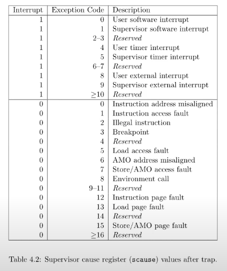
- 第三个信息是触发page fault指令的地址，在lec6中我们直到这个指令地址存放在stpc中

所以概括来说，就是三个信息
- 引起page fault的虚拟内存地址
- 引起page fault的原因
- 引起page fault时的程序寄存器

### 8.2 Lazy page allocation
首先来看一下内存的分配，sbrk使得用户应用程序能够扩大自己的堆空间。当一个应用程序刚刚启动的时候堆的空间为0，此时sbrk指向heap的最底端，同时也是stack的最高端。此时这个位置通过p->sz表示
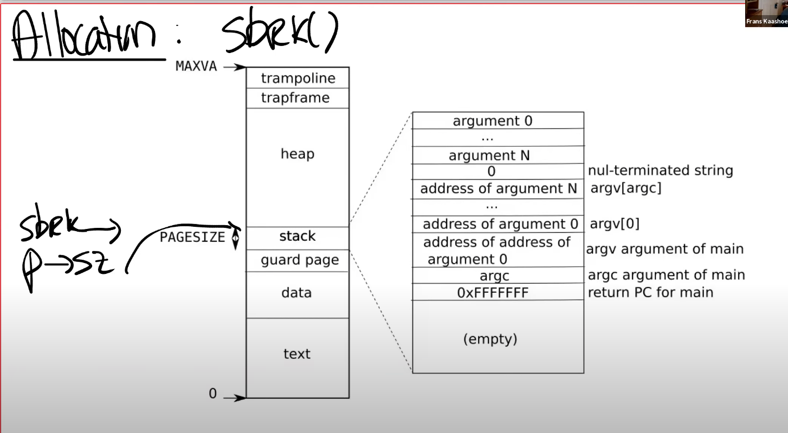
调用sbrk的时候它会代表申请了额外多大的字节，也可以是缩减。以扩大空间为例子，内核会分配一些物理内存，然后把这些物理内存在p->pagetable中映射，然后把内容初始化为0，再返回到sbrk系统调用。

xv6中，sbrk默认的实现是eager allocation,一旦调用sbrk会马上进行分配。但是实际上，应用程序申请额外的堆空间对他自己来说是不确定的，因此会申请一个较大的内存。这会导致空间和时间上的浪费。
我们可以利用va 和page fault handler实现layallocation.
核心思想：sbrk基本不做任何事情，只需要p->sz = p->sz + n;之后在某个时间点，应用程序使用到了新申请的那部分内存，触发page fault.如果一个地址大于旧的p->sz，小于current p->size,则分配一个内存的page，并且重新执行指令。

代码部分：
首先修改sys_sbrk函数
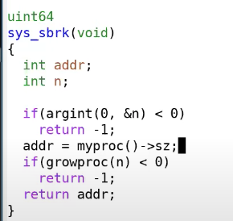

->

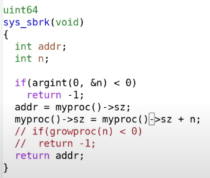

启动xv6,并且执行echo hi.会得到一个page fault
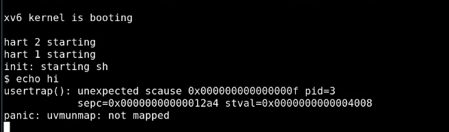
 
产生page fault的原因是，shell执行程序，先fork一个子进程，子进程通过exec执行echo.在这个过程中shell会申请内存空间，调用sys_sbrk,然后出错
从错误信息，我们可以发现一些事情：
- scause = 15,说明是store fault
- pid = 3 很有可能是shell进程产生的page fault
- sepc,代表引起page fault的源代码位置
- stval，page fault真正的位置。

实际上sbrk会初始化我们申请的内存，因此会产生page fault，我们在向实际上没有分配的page写数据。
之后我们在usertrap中处理page fault

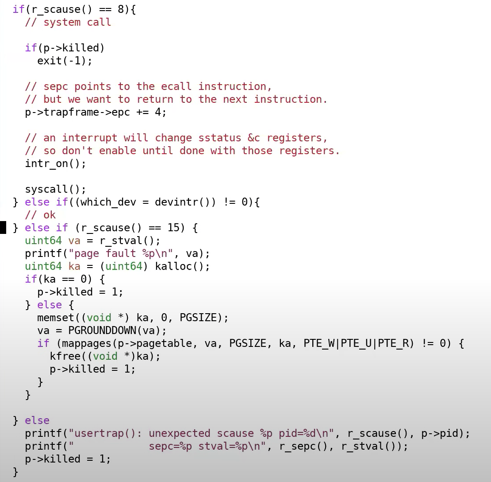
接下来运行代码我们会发现
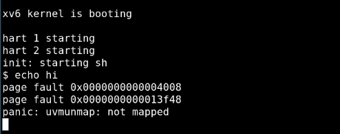
uvmunmap一直在报错，这里是因为它在尝试unmap之前lazy allocation但是还没有被实际分配的page.因此我们可以在uvmunmap中修改它的默认行为

实际上申请的heap内存是离散型的，我们只需要跳过那个没有被实际分配的内存即可。

### 8.3 Zero Fill on Demand
在csapp中，介绍了bss区域，它其实是不占空间的，具体的实现就是Zero fill on demand
bss包含了未初始化或者被初始化为0的全局变量
把这些变量单独放出来的原因是，例如在C语言程序中定义了一个很大的矩阵作为全局变量，它的初始值为0，实际上我们只需要知道它的内容是0，不需要分配内存
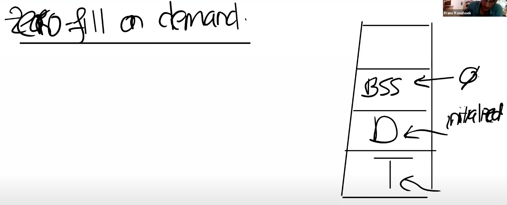

在一个正常的操作系统中，如果执行exec,会申请地址空间，里面存放text和data.bss保存了许多变量，所以它有很多pages.但是所有的page内容都为0，因此他们只需要被映射到相同物理内存的page即可。

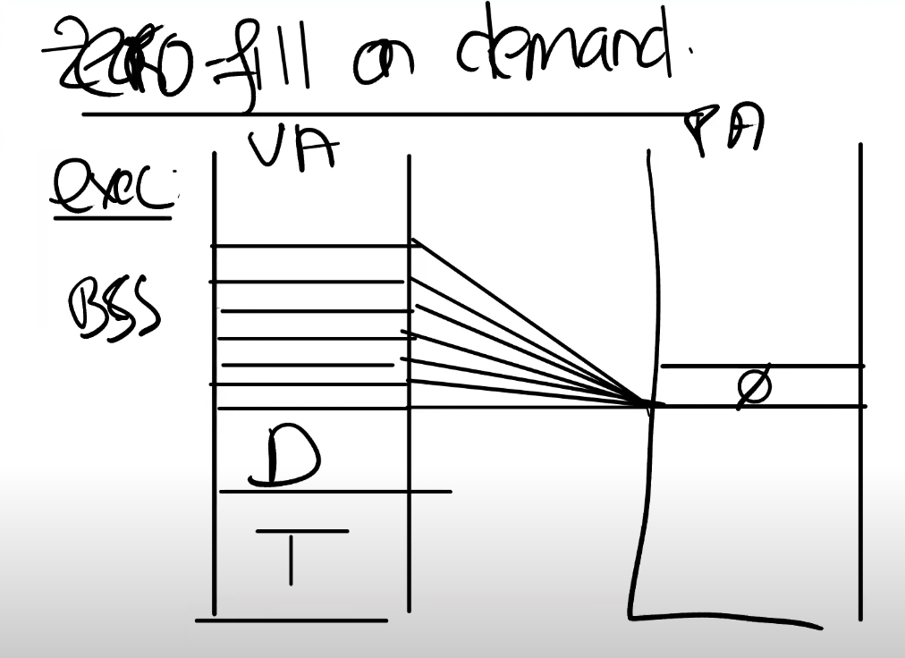
这里的映射需要很小心，因为如果我们初始化一个变量为1例如，我们不能影响其他没有初始化或者初始值为0的全局变量。因此这里所有的PTE都是READ_ONLY的.
如果我们要写一两个变量的值，我们会得到page fault,对于这个page fault，我们应该创建一个新的page table并且将其内容设置为0，更改映射并且重新执行指令。这里的PTE权限应该是R & W

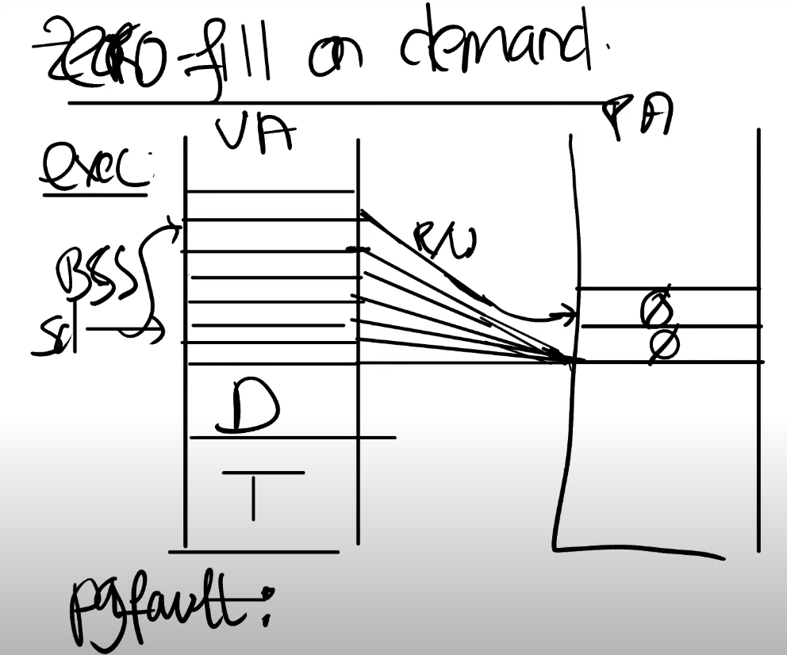
思考page fault的代价问题

### 8.4 Copy on Write fork
COW是下一个lab的作业
在shell处理指令的时候，它会通过fork创建一个子进程来执行。观察fork()函数，它会拷贝父进程的所有内存空间。子进程之后调用exec来运行一些其他程序。
但是现在的问题是exec在继承了父进程的pagetable映射关系之后，又丢弃了他们(物理内存+虚拟内存映射),进行重新的映射。这样显得很浪费，COW提供了一种解决方式.
当我们创建子进程的时候，我们可以直接共享父进程的物理内存page,所以直接设置childprocess->pagetable pte parentprocess->pagetable pte;
我们要实现子进程和父进程之间的隔离性，因此要保证当子进程修改映射的时候，父进程不变。这里可以把子进程和父进程的Pte都设置为只读
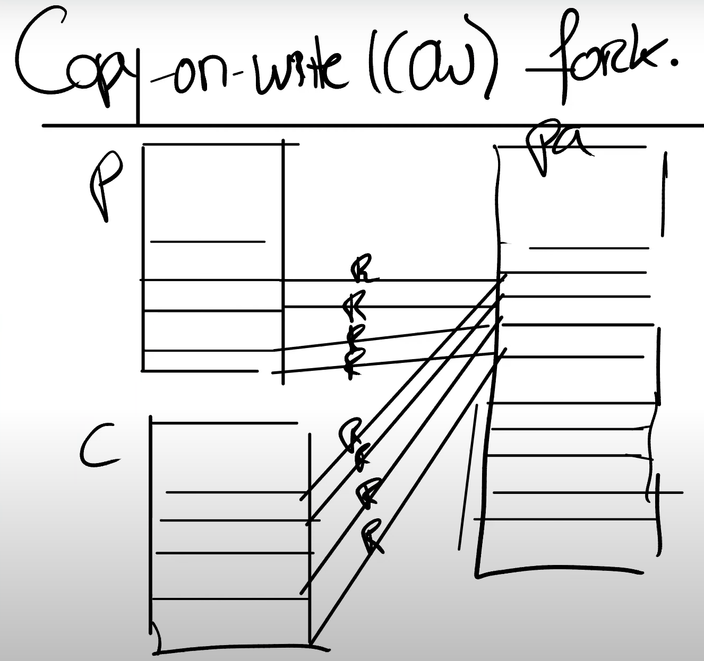
在某个时间点，需要更改内存的内容时候，我们会得到Page fault.假设现在是子进程在执行store指令，那么我们会先分配一个物理内存page,然后把相关的物理内存拷贝到新的物理内存page中，更改子进程的映射。同时这时候新的pte和旧的pte都可以更改为可读写的，（注意这里有限制，物理内存必须存在唯一的映射关系否则父进程pte不能修改)
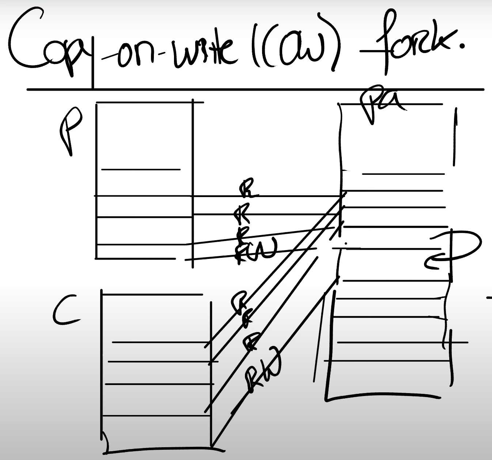
重新执行用户指令是指userret
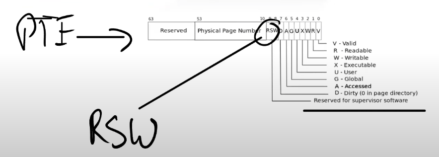
通过PTE上的flags来判断这个物理内存是否是COW
注意，我们在释放内存的时候要变得格外小心，我们需要对每一个物理内存的page的引用进行计数，freeproc只有在它的物理内存count==1的时候才能释放Physical page

### 8.5 Demand Paging
我们回到exec中，发现exec是以eager allocation的方式分配text & data的内存空间。所以为什么我们不等等直到应用程序实际需要这些指令的时候加载进去。
所以在exec中，我们分配为text和data分配好地址段，但是相应的PTE不映射任何PA,只需要把他们设置为invalid
我们应该怎么处理这里的page fault呢？
我们需要在某个地方记录这些demanding page对应的程序文件，然后在page fault handler中读取程序数据(e.g.磁盘中)加载到内存中，之后把内存page映射到pagetable中，最后再重新执行指令。

如果物理内存耗尽了怎么办？
一个选择是驱逐page(evict page),将部分内存page中的内容写回到file system。这样我们就有了一个空闲的page,可以分配给刚刚的page fault handler,再重新执行指令。

什么样的page可以被撤回？并且用什么策略来撤回page?
- 一种策略是LRU(least recently user )

如果要撤回一个page,选择dirty page(曾经被写过的page) 还是non-dirty?
- non-dirty,因为dirty page 之后再被修改，需要对它写两次

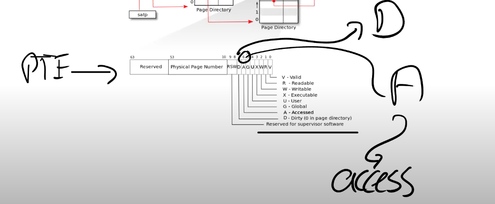
这里标出了dirty page flag
access flag通常被用来实现LRU

### 8.6 Memory Mapped files
mmap核心思想是把完整或者部分文件加载到memory中，这样就可以通过和内存地址相关的指令来操纵文件
为了支持这个功能，现代操作系统提供了一个mmap的系统调用，接受一个虚拟内存地址(VA),长度，protection,标志为，一个打开文件的描述符，和偏移量
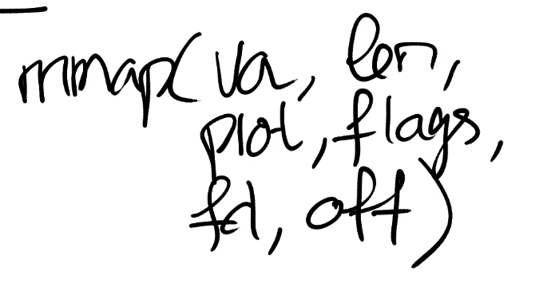
这里的语义是映射fd+off开始的文件len bytes到va,同时赋予这个区域一些Protection flags,例如只读只写。

完成操作之后，相应还存在一个unmap函数，参数是va和len.当unmap的时候，我们需要将dirty block写回到文件中。

在任何聪明的内存管理机制中，这些实现都是以lazy的方式实现的，先记录PTE属于哪个fd,相应的信息会再VMA结构体中保存，Vitual memory area,.当我们得到一个位于VMA地址范围的page fault时，内核可以从磁盘中读数据。