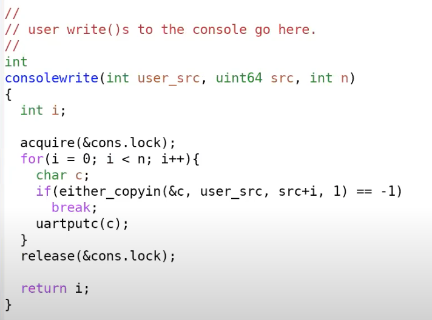

- [Lecture 09: Interrupts](#lecture-09-interrupts)
  - [Book Reading: Chapter 5 Interrupts and device drivers](#book-reading-chapter-5-interrupts-and-device-drivers)
    - [5.1 Code : Console input](#51-code--console-input)
    - [5.2 Code : Console ouput](#52-code--console-ouput)
    - [5.3 Concurrency in drivers](#53-concurrency-in-drivers)
  - [Class](#class)
    - [9.1 中断的硬件部分](#91-中断的硬件部分)
    - [9.3 设备驱动概述](#93-设备驱动概述)
    - [9.3 XV6中断设置](#93-xv6中断设置)
    - [9.4 UART驱动的top部分](#94-uart驱动的top部分)
    - [9.5 UART driver's bottom part](#95-uart-drivers-bottom-part)
    - [9.6 Interrupt相关的并发](#96-interrupt相关的并发)
    - [9.7 UART读取键盘输入](#97-uart读取键盘输入)
# Lecture 09: Interrupts
[Lab](https://github.com/JasonJ2021/6.S081/tree/main/Lec9%20Interrupts)
## Book Reading: Chapter 5 Interrupts and device drivers
驱动是操作系统用来管理一个设备的代码，它有四个基本功能：
- 设置了设备的硬件.
- 告诉设备要执行什么样的操作.
- 处理产生的中断.
- 和可能在等待I/O设备返回进程的进程交互.

如果一个设备需要操作系统的“关注”，它会产生一个中断,三种trap的一种。trap handling code识别device interrupt，然后调用驱动的中断处理程序.在xv6中，发生在devintr函数中(kernel/trap.c)

许多驱动程序有两个内容
- *top half*运行在内核线程中，通过系统调用(e.g. read write 等想要设备执行I/O操作的函数)调用top half context.这一部分的代码可能会让硬件开始执行一个操作，然后等待这个操作完成。最后这个设备完成操作，产生一个中断
- *bottom half* 通常是一个中断handler，识别哪个操作已经完成，如果可以的话唤醒一个进程，然后告诉硬件去执行下一个操作。

### 5.1 Code : Console input
console driver接受用户输入的字符，通过连接到RISC-V的UART串行端口硬件。
它一次收集一行输入，处理一些特殊的字符例如(ctrl + u).用户进程，使用read系统调用来从终端取一行输入。

UART硬件对于软件来说是一系列memory-mapped的control register(直接映射，在kernel初始化物理内存空间的时候可以看到),也就是说对于特定的物理内存空间进行load , store操作会直接和设备交互。UART开始的位置在0x10000000(defined in kernel/memlayout.h).

UART有许多一个字节的寄存器，他们的偏移量被定义在uart.c中，例如：
LSR寄存器，包含一些比特位表示是否有一个软件在等待read字符。这些字符可以在RHR寄存器中被读取，每次一个字符被读取后，UART会把它从内部FIFO等待字符区删除调，如果FIFO是空的，LSR的"ready"bit会被清空。而对于transmit硬件来说，如果一个程序write a byte to THR,UART会发送这个byte.

Xv6的main调用consoleinit(console.c)来初始化UART hardware.它会设置UART,使其在收到一个input byte就会产生receive interrupt,发送一个output byte产生*transmit complete* interrupt

xv6 shell通过文件描述符(opened in init.c)的方式从终端读取数据.*read*调用会进入内核到consoleread函数，它等待输入到达(通过中断的方式通知)，然后在cons.buf中缓存，复制输入到用户区域，最后在一行输入都获得之后返回到用户进程。如果用户还没有输入完整的一行，那么所有reading processes都会通过sleep()等待

当一个用户输入一个字符后，UART会产生一个中断，trap handler调用devintr(trap.c),它会查看scause寄存器来判断这个干扰是否来自于外部设备。然后它会通过调用PLIC来得知哪个设备产生了Interrupt.如果是UART，devintr调用uartintr

uartintr会从UART获取字符，然后把它交给consoleintr函数.consoleintr的工作是把输入的字符收集在cons.buf缓冲区直到一个完整行到达,之后consoleintr唤醒read processes

在被唤醒之后consoleread会在cons.buf缓冲区获得一个完整行，把它复制到user space,最后返回到user space.

### 5.2 Code : Console ouput
write系统调用最后通过uartputc连接到终端,设备驱动维护了一个输出buffer(*uart_tx_buf*).uartputc会把每个字符添加到缓冲区，然后调用uartstart开始传输，最后返回。只有buffer已经满的情况,uartputc会等待
我认为5.1和5.2的重点在于,每发送和接受一个byte都会引起一个中断！

### 5.3 Concurrency in drivers
有三个并发危险：
- 在不同CPU的两个进程可能会同时调用consoleread
- 硬件可能会请求产生一个console中断，当CPU已经在执行consoleread
- 当consoleread正在执行的时候，硬件可能会在不同的CPU产生中断

另外我们发现在中断处理中没有调用copyout,因为有可能在中断处理发生的时候，那个进程并不是原来那个请求输入的进程。

## Class

### 9.1 中断的硬件部分
当一个硬件需要操作系统的关注时，就会产生一个。它的机制和system call , exceptional类似。

但是它有三个小的差别
- 异步(asychronous),当硬件产生中断时，hanndler和运行在CPU的当前进程没有任何关联。
- 并发(concurrency),CPU和生成中断的设备是并发的。例如网卡自己独立处理来自网络的packet,然后在某个时间点产生中断。
- program device.我们需要对外部设备编程

这节课主要讨论两个问题，分别对应了write & read
- console 中的'$'是如何显示出来的
- 在键盘输入ls，这些字符怎么在console中显示出来

我们主要关注外部设备产生的中断。

所有设备都会被连接到处理器上，而PLIC(Platform Level Interrupt Control)是用来管理设备中断的.
下面是PLIC的结构图

有53个设备的中断被连接到了PLIC，到达PLIC之后，它会route这些中断。PLIC会把中断分配给CPU处理，具体的流程：
- PLIC会通知当前有一个待处理的中断
- 其中一个CPU会声明它接受了中断，这样PLIC就不会把中断发给其他的CPU处理
- CPU core处理完中断之后，CPU会通知PLIC
- PLIC会把这个处理完的中断移除。

### 9.3 设备驱动概述
通常来说，管理设备的代码称为驱动，所有的驱动都位于内核中。
驱动由bottom/top组成

bottom部分是Interrupt handler.
top部分是用户进程或者内核其他部分调用的接口。对于UART来说有read/write接口
通常来说，驱动中会有一些缓冲区。interrupt handler会向队列读写数据，而top部分的代码接口也会读写。这样实现了top & bottom decoupling

对于handler来说有一些限制，因为它没有运行在任何进程的上下文中，所以不能用页表。

接下来讨论device programming
在之前的课程中，我们看到memory mapped I/O machanism.操作系统需要知道hw具体所在位置，然后通过load/store指令对这些地址进行编程。
下面是siFive主板中对应设备的物理地址

下面是UART的文档

### 9.3 XV6中断设置
"\$"和"ls"处理不太一样，\$是shell程序的输出，而ls是用户的键入。

对于$来说，实际上是设备会将字符传输给UART的寄存器，UART在发送完字符之后产生一个中断。线路的另一端还有一个UART芯片，连接到console，进一步将\$显示在console上.

对于"ls",键盘连接到了UART的输入线路，当我们输入'l'时，UART芯片会把字符通过串行线发送到另一端的UART芯片。另一端的UART芯片把bit合并成一个Byte，产生一个中断，然后Interrupt handler会处理来自于Uart的字符。

RISC-V有许多与中断有关的寄存器:
- SIE(Supervisor Interrupt Enable).有三个BIT针对不同的中断 E->external T->timer S->software
- SSTATUS寄存器，有一个bit设置CPU核是否会接受中断
- SIP(Supervisor Interrupt Pending)寄存器，我们可以通过查看这个寄存器知道是什么种类的中断
- SCAUSE寄存器。
- STVEC寄存器

代码部分，首先是start(start.c)，它运行在machine mode.

这里把所有中断都交给到supervisor mode处理，进行了一些初始化设置。
然后从mret到main

main函数中，首先进行console初始化

    void
    consoleinit(void)
    {
      initlock(&cons.lock, "cons");

      uartinit();

      // connect read and write system calls
      // to consoleread and consolewrite.
      devsw[CONSOLE].read = consoleread;
      devsw[CONSOLE].write = consolewrite;
    }

调用了uartinit

    void
    uartinit(void)
    {
      // disable interrupts.
      WriteReg(IER, 0x00);

      // special mode to set baud rate.
      WriteReg(LCR, LCR_BAUD_LATCH);

      // LSB for baud rate of 38.4K.
      WriteReg(0, 0x03);

      // MSB for baud rate of 38.4K.
      WriteReg(1, 0x00);

      // leave set-baud mode,
      // and set word length to 8 bits, no parity.
      WriteReg(LCR, LCR_EIGHT_BITS);

      // reset and enable FIFOs.
      WriteReg(FCR, FCR_FIFO_ENABLE | FCR_FIFO_CLEAR);

      // enable transmit and receive interrupts.
      WriteReg(IER, IER_TX_ENABLE | IER_RX_ENABLE);

      initlock(&uart_tx_lock, "uart");
    }

这里先屏蔽了所有interrupt,然后进行一些初始化设置，最后开启transmit & receive interrupt.
运行完这个函数之后，UART就可以产生中断了，但是我们没有对PLIC进行编程，不能对中断进行管理。

    void
    plicinit(void)
    {
      // set desired IRQ priorities non-zero (otherwise disabled).
      *(uint32*)(PLIC + UART0_IRQ*4) = 1;
      *(uint32*)(PLIC + VIRTIO0_IRQ*4) = 1;
    }

这里只设置了两个能够被接受的中断，之后uart virtio能够被路由到CPU HART
在plicinit之后还有plicinithart(void)。因为我们只在Hart = 0 的核进行了plicinit,但是我们要让所有的CPU 核心都表示对中断的兴趣，所以需要设置。

    void
    plicinithart(void)
    {
      int hart = cpuid();
      
      // set uart's enable bit for this hart's S-mode. 
      *(uint32*)PLIC_SENABLE(hart)= (1 << UART0_IRQ) | (1 << VIRTIO0_IRQ);

      // set this hart's S-mode priority threshold to 0.
      *(uint32*)PLIC_SPRIORITY(hart) = 0;
    }

在这里我们还需要设置CPU本身能够接受中断。在main函数最后有scheduler()，里面在调度之前都会intr_on

    static inline void
    intr_on()
    {
      w_sstatus(r_sstatus() | SSTATUS_SIE);
    }

### 9.4 UART驱动的top部分

在main函数(init.c)中创建了console的设备，然后复制2个文件描述符，他们分别的编号是0、1、2，因为console是第一个打开的文件。Unix系统会把所有设备当作文件。

    int
    getcmd(char *buf, int nbuf)
    {
      fprintf(2, "$ ");
      memset(buf, 0, nbuf);
      gets(buf, nbuf);
      if(buf[0] == 0) // EOF
        return -1;
      return 0;
    }
之后来到putc

write调用最终来到sys_write

这里我们的文件描述符类型是设备，因此到了第二个if中，调用devsw.write.

这里先使用either_copyin把字符拷贝进来，然后调用uartputc(c)把字符显示到console.所以可以认为consolewrite是driver的top part.

uartpuc把字符放到内部的一个环型队列中，然后调用uartstart()

uartstart就是通知设备执行操作，它会把字符c放到THR上发送。在某个时间点上，我们会收到中断。

### 9.5 UART driver's bottom part
当CPU接受了中断会发生什么？
- 清除SIE中的bit，使CPU核不被其他中断打扰，处理完恢复。
- 保存PC->SEPC
- 保存当前的mode
- 设置mode = supervisor mode
- 把PC设置为STVEC的值

在usertrap中

调用devinr函数

首先检查这个中断是不是来自外部设备的中断，如果是调用plic_claim获取中断的种类。

    void
    uartintr(void)
    {
    // read and process incoming characters.
    while(1){
        int c = uartgetc();
        if(c == -1)
        break;
        consoleintr(c);
    }

    // send buffered characters.
    acquire(&uart_tx_lock);
    uartstart();
    release(&uart_tx_lock);
    }
这时候因为UART的接受寄存器为空，所以跳过循环，然后执行uartstart发送。
其实这里uartstart发送的是空格，因为$在上一次的uartstart被发送了。

### 9.6 Interrupt相关的并发
- 设备和CPU并行运行，例如当UART向console发送一个字符的时候，shell可能又进行了一次write,向buffer中又添加了一个字符。 ---producer-consumer并行
- 中断会停止当前运行的程序。所以我们要关注内核mode的中断
- 驱动的top & bottom是并行运行的。他们都会操作buffer,所以我们需要锁，来确保buffer在同一个时间只被一个CPU核操作。

下面主要关注producer-consumer concurrency

buffer有32个字节大小，并且有两个指针

如果两个指针相等，那么buffer为空。如果w +1 = r,那么buffer满了。如果buffer满了，我们必须要停止producer进程。
Interrupt handler 也就是uartintr函数是消费者。有一个中断产生的1时候，uartintr就会从读指针中读取一个字符然后通过UART设备发送。

### 9.7 UART读取键盘输入

fileread这里调用的是consoleread

这里可以看到consoleread如果buffer为空shell会sleep直到键盘输入一个字符。如果输入了"l",它会被发送到UART芯片，产生中断然后触发devintr，先进入到uartintr，通过uartgetc获得buffer上的字符之后进入consoleintr

    while(1){
        int c = uartgetc();
        if(c == -1)
          break;
        consoleintr(c);
      }

这里也是通过buffer把consumer 和 producer之间解耦，这样才能独立的并行运行。e